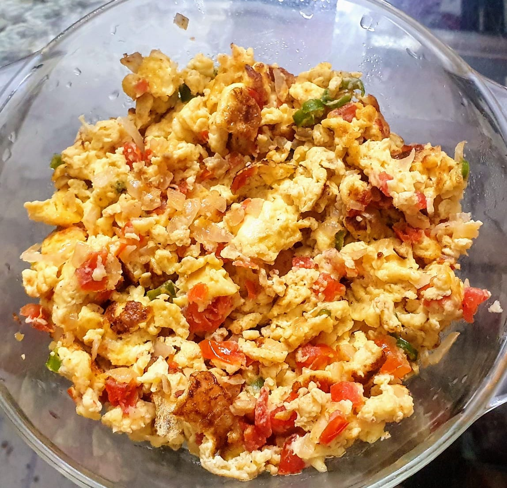
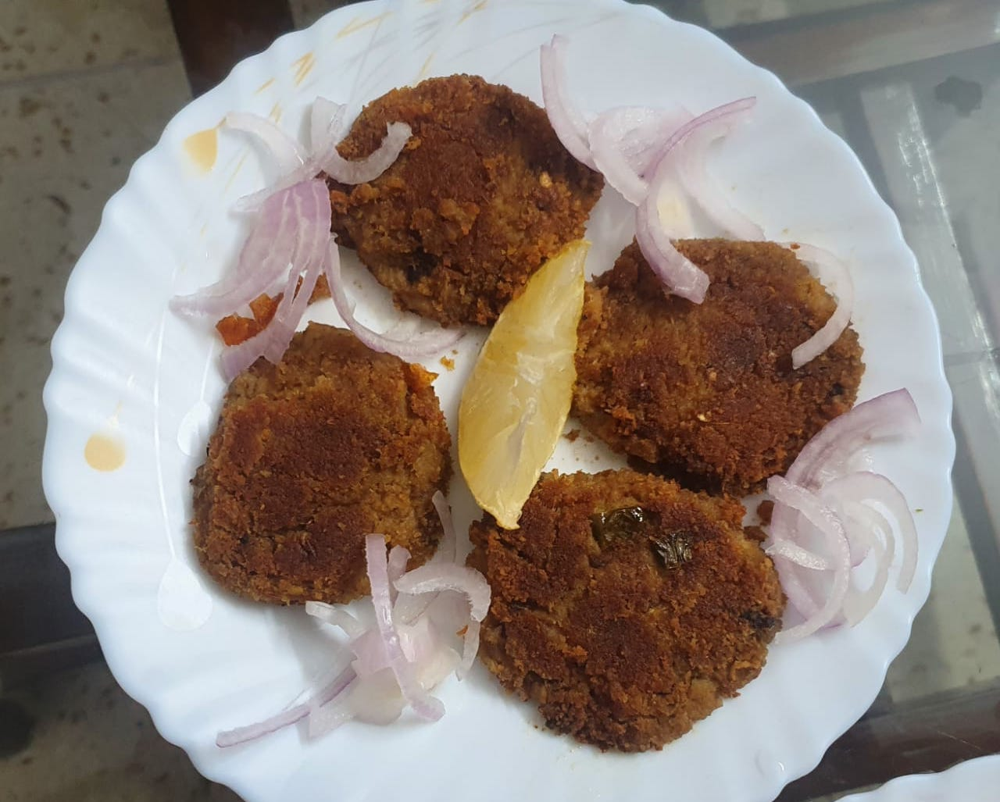
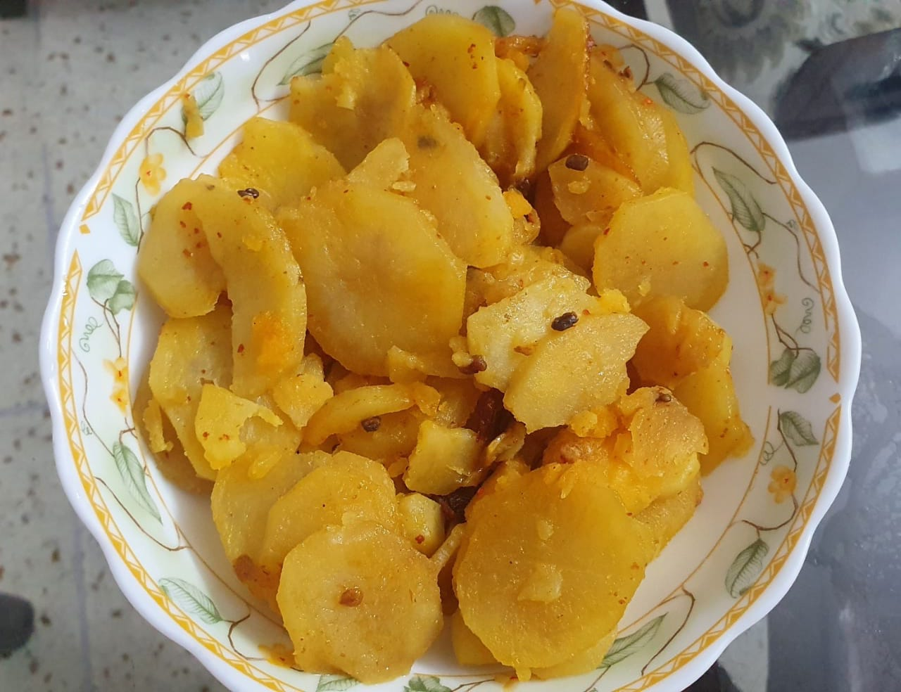

The preferred breakfast in our family is flatbread (Roghni Tikiya), served with at least 2 (but sometimes 3 or even 4) accompanying dishes. We are presenting here our recipes for our favorite breakfast.

### Bread - [Roghni Tikiya](/roghni-tikiya)

### Eggs - [Khagina](/khagina)

### Meat - [Shami Kabab](/shami-kabab)

### Potatoes - [Qatli Aaloo](/qatli-aaloo)

