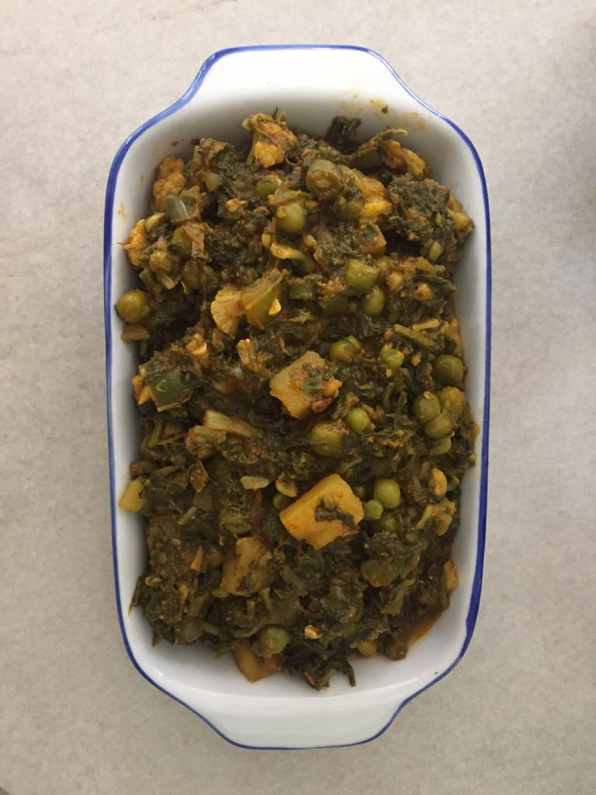

Servings: 4-5 people
Difficulty: Medium

# Ingredients

* 500 grams chopped spinach
* 1/2 cup cut fresh fenugreek leaves OR 2 1/2 tablespoons dry fenugreek leaves
* 1/2 cup cut fresh dill OR 2 1/2 tablespoons dry dill 
* 500 grams total of mixed vegetables below:
  * cauliflower 
  * green bell peppers(Shimla mirch)
  * eggplant
  * green peas
  * potatoes 
* 4 medium ripe tomatoes 
* 1/8 teaspoon fenugreek seeds(methi dana)
* 1/2 teaspoon cumin
* 1/8 teaspoon nigella (kalonji)
* 1/2 cup finely chopped onions
* 2 1/2 teaspoons finely cut garlic
* 2 1/2 teaspoons finely cut ginger
* 2 1/2 teaspoons ground coriander powder(from lightly roasted coriander seeds)
* 2 teaspoons ground cumin powder(from lightly roasted cumin)
* 3 tablespoons  mustard or neutral oil 
* 2 slit green chillies (optional)
* 3/4 teaspoon red chilli powder( if not using green chillies increase to 1 teaspoon)
* 3/4 teaspoon turmeric
* Hot water to fry masala/spices

# Directions

Wash vegetables and herbs if using fresh ones, then drain. 

Finely chop tomatoes, onions, garlic, and ginger. Keep aside, and do not mix them.

Chop spinach, and herbs-fenugreek and dill if using fresh.

Dice green pepper into 1" pieces. 

Peel and dice eggplant and potatoes into 1" cubes, and cauliflower into 1" pieces as well. 

If using mustard oil, smoke and cool till warm.

Over low flame, add mustard seeds first, when they just begin browning, quickly add nigella and cumin. When cumin splutters quickly add onions, and increase heat to medium. After two minutes, add ginger and garlic, and reduce heat to low again. When onions are a nice golden colour, increase flame to medium, add tomatoes and all spices, and keep frying by adding 1-2 tablespoons hot water, till oil fully separates, and floats on top.

Now add all vegetables and herbs, give a good stir. DO NOT add any water, the vegetables contain enough. Increase heat to high without lid for five minutes while stirring continuously. Reduce to medium for ten minutes, stirring all the time, then finally on low, and cover with lid. Give a stir once in a while. When potatoes are 3/4 done, remove lid, and cook till all water is dried up. Enjoy the aromas! Serve with garlic-chilli chutney, and roti made from gram flour(besani/missi roti).
