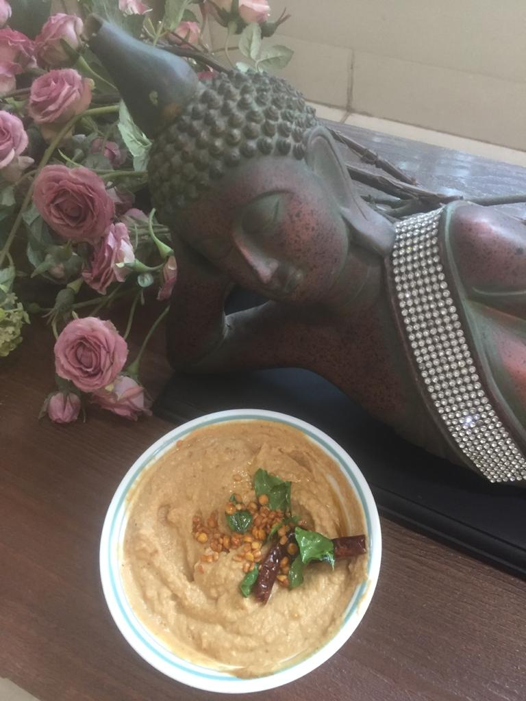

Difficulty: Easy

# Ingredients 
* ½ cup roasted gram (_bhuna chana_)
* 4-5 garlic cloves
* Marble size ball of tamarind or equivalent 
* 2 tsp oil
* ½-1 dry red chilli, or as per taste
* 1 tsp salt
* 2 tsp pounded jaggery (_gur_) OR brown sugar (optional)
* 2-3 tsp water

# Directions 

In oil, fry garlic over a slow flame — if cloves are big, chop them first. 

In the same oil, fry chilli and take it out quickly since it browns extremely fast. Remove and put with garlic.

In remaining oil, fry gram till it only slightly changes colour. Be careful not to overdo as the taste will change. Remove and cool. 

Grind all ingredients including any leftover oil. If too thick, add 1-2 teaspoons more of water. Note that you may like to add only 1 teaspoon of jaggery first.

Check consistency, and taste also. If you wish a slightly sweet taste, add the remaining jaggery. I like it a little sweet, it counters the heat also.  Enjoy with dosas, idlis, utthapams, etc!
