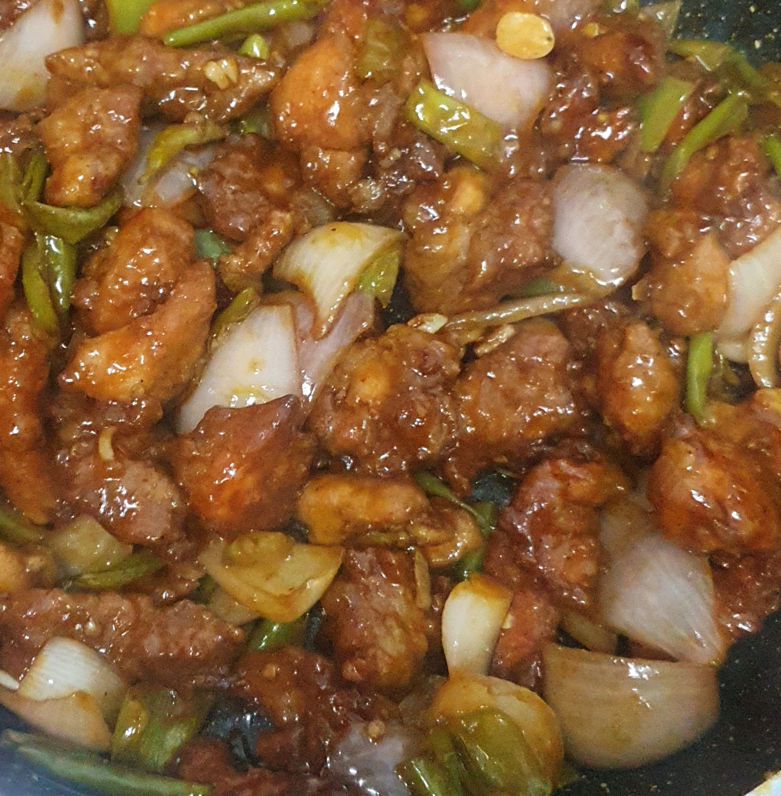

Credit: Salim Rizvi  
Servings: 4  
Prep Time: 15 mins  
Cook Time: 30 mins  
Difficulty: Easy    

# Ingredients
- 500g boneless chicken, sliced
- 1 egg (slightly beaten)
- ½ cup cornflour (¾ + ¼)
- ¼ cup all-purpose flour (_maida_)
- ½ tsp garlic paste / finely chopped 
- ½ tsp ginger paste / finely chopped
- ½ tsp white pepper powder 
- 1 tsp chilly garlic paste (½ + ½)
- 1 tbsp salt
- 1 tbsp soy sauce (adjust according to strength) (¼ + ¾)
- ½ tsp sugar 
- 2 tbsp white vinegar
- 2 onions, sliced
- 4-5 tsp green thai chiles (_hari mirch_), sliced and de-seeded
- ½ cup sliced green onion (_hari pyaaz ka saaga_) (optional – for colour)
- Oil, to deep fry

# Preparation
Mix together the chicken, egg, cornflour, all-purpose flour, ginger and garlic, chilly garlic, 1tsp salt, and mix it together to form a sticky lump and that the chicken pieces are coated with the batter. Leave this for about 30 minutes.

Heat oil in a wok or a pan and deep-fry / shallow fry the chicken pieces dipping each piece separately from the lump marinated over high heat to begin with and then lower the flame. Fry until the chicken is cooked through. Drain on absorbent paper.

Heat 2 tbsp of oil in a wok, add onions and stir-fry over high heat until they are translucent. Add the green chiles, shallots and sauté for a minute. Add salt, vinegar, chilly garlic, sugar and after tossing just put some water.

Add fried chicken pieces, soy sauce and make sure that you have a little bit of water dipping all the ingredients partly, add the mixture of cornflour with a little bit of water (make a thick paste) and toss all ingredients.

