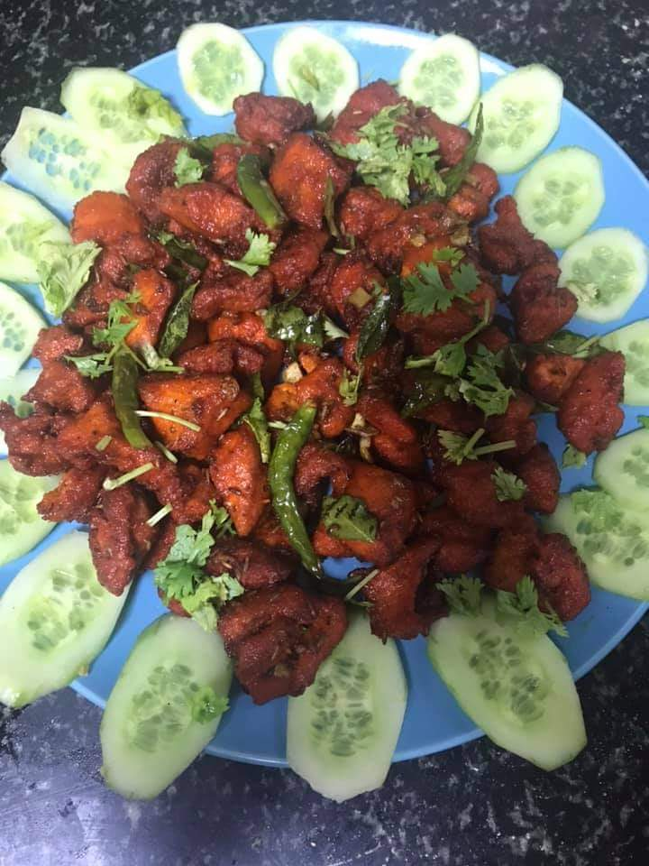

Difficulty: Medium  

# Ingredients

### For marination
* 1½ tbsp ginger paste
* 1½ tbsp garlic paste
* 1-2 tsp red chilli powder
* ½ tsp haldi powder
* 1 tbsp soy sauce
* 1 tsp white vinegar
* 2 tbsp cornflour
* 1 egg white
* ¼ tsp MSG (monosodium glutamate flavour enhancer)
* 1 tbsp oil plus extra for frying 
* Salt to taste
* A pinch of red food colour

### For yogurt
* 500 gms yoghurt 
* ½ tbsp ginger paste
* ½ tbsp garlic paste
* ½ tsp red chilli powder
* ¼ tsp haldi powder
* salt as per taste
* 2 tsp soy sauce
* ½ tsp white vinegar
* A pinch of red food colour
* 20 curry leaves (_kari patta_)
* 6-7 slit green chillies or according to taste

### For garnishing
* A few fried and slit green chillies

# Directions
Wash the chicken cubes well and drain water well or dry with paper towel.

Mix chicken with marination ingredients, and keep aside for 1-2 hours, preferably 2.

Deep fry chicken pieces in oil on medium flame. Poke fork or knife to see if done. Remove and drain on paper towel.

Mix all the yogurt ingredients except curry leaves and slit green chillies, and keep aside.

In an broad and open pan, heat 2-3 tablespoons of oil. Add about 20 curry leaves and 6-7 slit green chillies. As they begin to splutter add the yoghurt mix.

Stir and cook for 2 minutes. Now add fried chicken cubes. Stir and cook over slow fire until you reach the desired consistency, either thick gravy-like or dry. According to the author, dry tastes best.

Serve hot garnished with fried green chillies.

# Tips
> Chicken 65 is also prepared in a different way, popular in Andhra Pradesh, and is served in restaurants serving that cuisine. Read that recipe [here](/andhra-style-chicken-65/).
