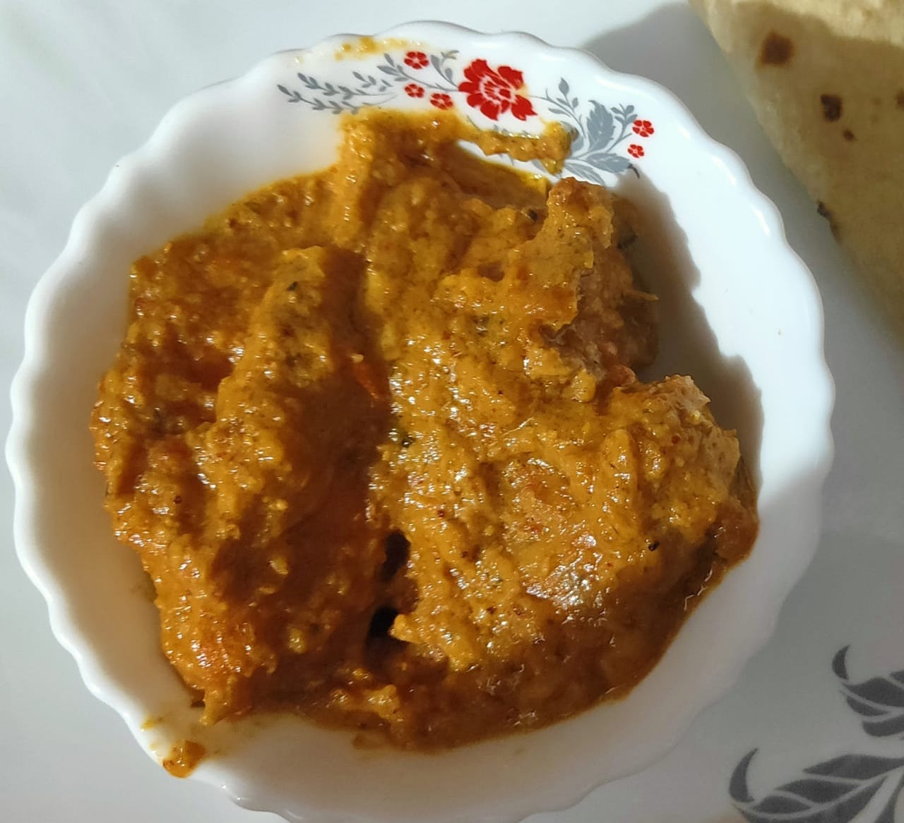

  
Difficulty: Medium

# Ingredients

### For marinade
* 1 kg chicken
* 1 tsp salt
* 1 tsp red chilli
* 3 tsp ginger garlic paste
* A pinch of food colour

### For the curry
* 2-3 tablespoons oil
* 1 tsp salt
* 1½ tsp red chilli powder 
* 1 tsp dry fenugreek leaves (_kasuri methi_)
* 2 tsp heaped coriander powder 
* 4 tsp ginger-garlic paste 
* 2 medium ground tomatoes 
* 1 cup whipped yogurt 
* 3-4 medium onions fried crisp and ground or crushed by hand
* 3-4 tablespoons fresh cream (optional)
* 1 tsp rose water
* 1 tsp kewra
* hot water for frying gravy

### For masala paste
* 2 tbsp coconut powder
* 2 tbsp chironji (lentil sized nuts available in Indian grocery stores, taste like almond)
* 12-14 cashews
* 2 tsp white poppy seeds

### Garam masala
* 15 peppercorns
* 1“ cinnamon stick
* 1 black cardamom seeds (_badi elaichi_)
* 4 green cardamom seeds (_elaichi_)
* 4 cloves
* 1 mace
* ⅙ teaspoon nutmeg (_jaifal_) powder
* ½ teaspoon cumin (_zeera_)

# Directions
Mix all the marinade ingredients well and marinate chicken for 15-30 mins. In the meantime, grind garam masala ingredients into a fine powder.

Post marination, put 1 tbsp oil in a pan and put in the marinated chicken. Roast on high flame for about 1-2 minutes till chicken seals. Cover and cook the chicken on slow for ten minutes without adding water. 

After ten minutes, remove lid and roast chicken till water dries up. It should be about 70 per cent done.

Now heat oil, add ginger-garlic paste and all the dry spices and stir. Add 2 tablespoons hot water to ensure that masala doesn’t burn. After frying for 1-2 minutes, add ground tomatoes and yogurt and cook well till oil separates.

Add ground onion and special masala paste and cook again till oil separates again.

Add fried chicken pieces and stir well for 5 minutes. Add garam masala and fresh cream. Stir and add rose water and kewra water.

Add 1 cup water and stir. Cover and cook for ten minutes or till done on low flame and serve.

Ready to serve. The curry's consistency should be on the thicker side.
