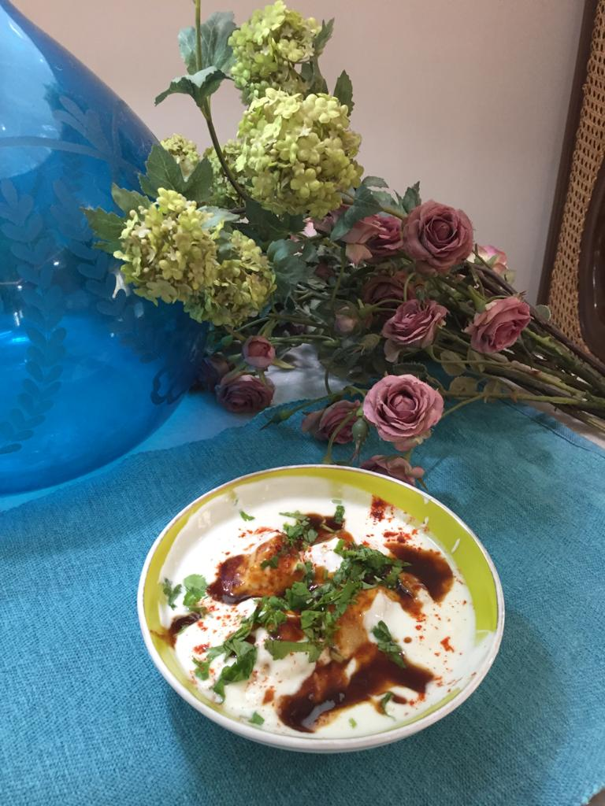

Servings: serves 6 people 

Difficulty: Easy

# Ingredients:

### For mungori:
* 1 cup skinless mung dal (Indian store)
* 1 teaspoon baking powder
* Lukewarm water for soaking fried mungoris 
* Oil for frying 

### For the yogurt:
* 600 grams yogurt
* 3/4-1 cup milk
* 2 teaspoons roasted ground cumin powder or according to taste plus extra for garnishing
* 1 1/2 teaspoons salt or according to taste
* 1 1/2 teaspoons red chilli powder or according to taste plus extra for garnishing
* 1-2 tablespoons chopped coriander (cilantro)

# Directions

Soak mung dal in about 2 1/2 cups of room temperature water for at least 30 minutes. It should swell up, if not fully done, then another 15 minutes.

Heat oil in small wok or kadhai.

Reserve about 1/4 cup water, and strain rest of water well.

Put dal in food processor, and now add 2 tablespoons of reserved water to dal, and grind in processor so that dal when checked by hand it is a wee bit grainy. Do not add extra water, and do not over grind. 

Turn over into a bowl, and mix in baking powder very thoroughly.

Keep oil between medium and medium high.

Drop mung batter by a teaspoon in batches, and fry till the yellow colour of the mungori just starts turning the lightest brown. Don't start turning immediately, rather spoon oil over top of mungori so top is cooked enough to turn, else batter will stick to your slotted spoon. 

Take one out and check with fork or knife. If it's spongy inside, it's done, but if you can still see uncooked batter, fry for another few minutes. Remove and put into lukewarm warm water for 5 to 8 minutes. 

Squeeze out all water gently and keep aside.

Whip up yogurt. Add 1/2 cup milk first. Check the consistency, if it's to your liking, then fine, else keep adding a little at a time, till desired consistency is reached. Add spices according to taste.

Dip mungoris in dahi. Sprinkle desired amount of red chilli powder and cumin powder on top. Dot with coriander. If extra are left, you may prepare more yogurt and milk for them. Serve with tamarind and jaggery chutney (see recipe for Sonth). Enjoy!

These freeze very well, so you can make more for later consumption.
