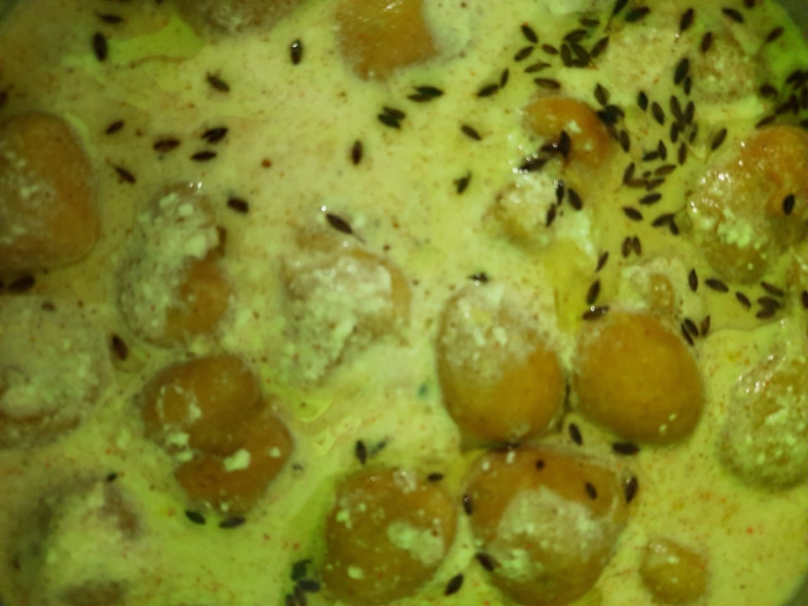

Servings: 10-15

# Ingredients
* 1kg yogurt, preferably slightly tangy
* 250g gram flour (_besan_)

### For the yofurt
* 2 tbsp paste of garlic and cumin (_zeera_)
* 1 tsp red chile powder
* Salt, to taste
* 1 tsp roasted zeera powder

### For the phulki batter
* 1 tsp red chile powder
* A pinch of salt
* 1 tsp zeera powder
* Oil, for frying

### For Tempering
* Mustard seeds (_rai_)
* Zeera
* Whole red chile (_saboot lal mirch_)
* Mustard oil

# Directions
Make a batter of besan and the listed ingredients. Beat it well so there are lots of air bubbles. Batter consistency should neither be runny nor too thick. To test the batter, take a glass of water and add a drop of batter . If it dissolves in water then it's too runny. If its thick but stays at the bottom of the glass then the consistency is right but you need to beat it more and incorporate more air. If the batter is perfectly made the drop rises in water.

In a kadhai or deep pan add enough oil to fry the phulkis. Check that the oil is hot before starting to fry the phulkis. When it is hot enough, turn down the flame to a medium to allow the phulkis to fry throughout and not just the outside

Now drop dollops of batter, with the help of spoon or with your finger, into oil and deep fry till golden. Don't add too many at once because then the phulkis won't be able to fry well. Once you finish frying all. Keep them aside.

Take yogurt in a big bowl or vessel and beat it well. It should again be pouring consistency but not runny. Add salt, chile powder, roasted zeera and garlic-zeera paste. Taste and adjust seasoning as needed. Now take the fried phulkis and put in a bowl of water and squeeze before adding to the yogurt bowl.

Temper the dahi phulki with zeera, rai and saboot red chile fried in mustard oil. Ready to serve.

# Tips
> If you dont have tangy yogurt, you can mix some thick yogurt with buttermilk.

> This dish has a slightly rustic taste with the yogurt being tangy and spicy unlike dahi badas which are served in a thick and sweet yogurt.
