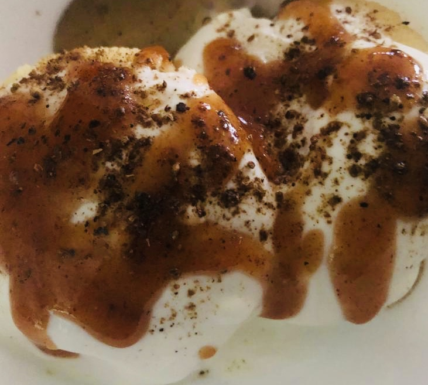

# Ingredients

### Dal mix

* 1 cup of split urad daal
* 1 cup black eyed beans
* 1 cup split Matpe beans
* 2 green chillies
* 1 inch ginger
* 2 tbsp coriander seeds need to be ground in a fine powder and mixed into the batter

### Spice mixture
* 1 tsp of red chilli powder
* 2 tbsp of black salt
* 3 tbsp of roasted cumin seeds ground
* Salt, to taste

### Yogurt mix
* 500 grams of yogurt beaten with a whisk.
* 1 tsp of sugar
* Salt, to taste

# Directions
Make a nice batter with urad daal and Maple beans flour as well. Once the batter is done, put cold water in and make reasonably sized balls and deep fry to make vadas. Excess oil can be drained on a paper towel.

Once the vadas are made soak them in water for 5-7 mins. Squeeze out the excess water from them. Lay them on a plate and add beaten yogurt and tamarind chutney on top.

Sprinkle chaat masala over the vadas to your taste.
