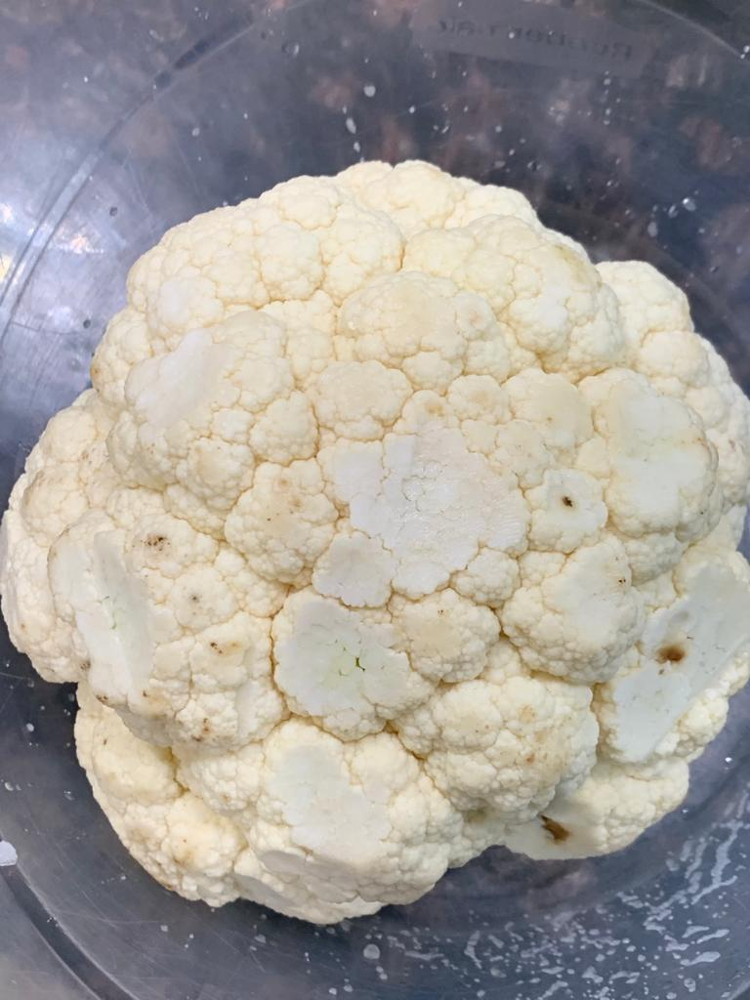
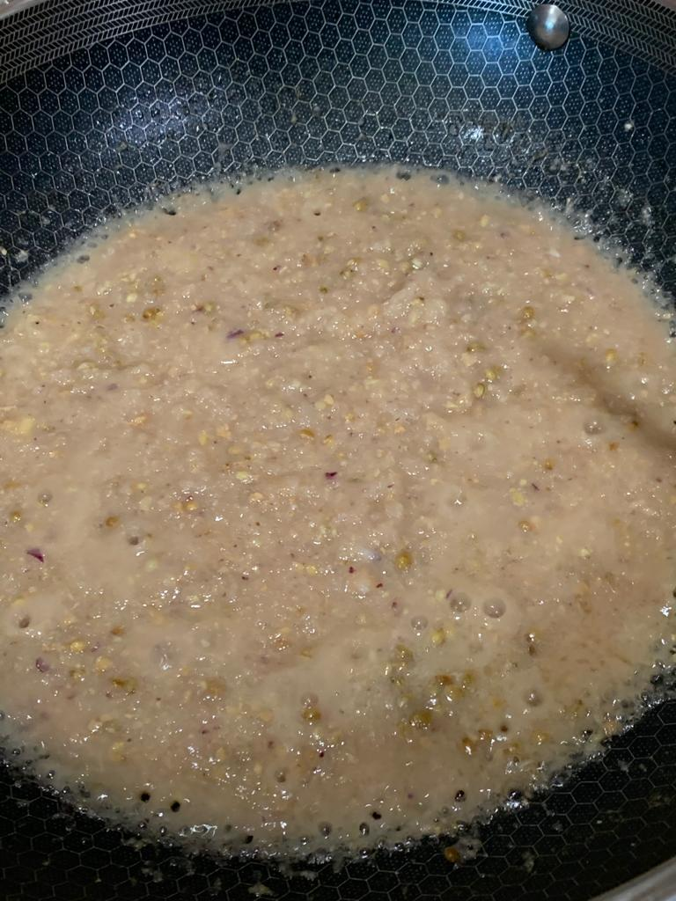
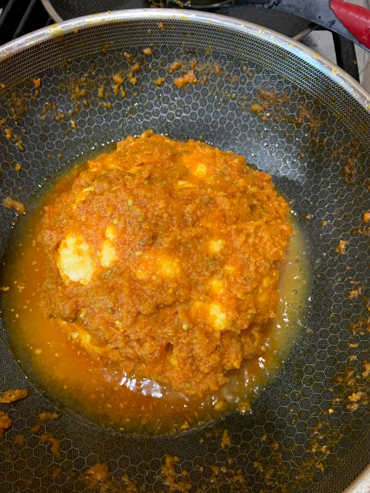
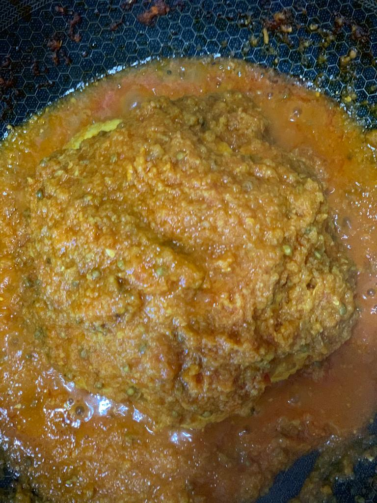

Servings: 4-5  
Difficulty: Medium  

# Ingredients
* 700g cauliflower (_gobhi_)
* 100g onion, finely chopped
* 6 cloves garlic
* 4 tsp coriander (_dhania_) seeds 
* ½ tsp red chile (_lal mirch_) powder
* ¼ tsp garam masala 
* 1 tsp turmeric powder (_haldi_)
* 1½ tsp salt, plus ¾ tsp for frying
* 100ml mustard oil or any neutral oil
* 20g root ginger
* 2 green thai chiles (_hari mirch_) (optional garnishing)
* 2 tbsp chopped green coriander
* 400g tomatoes 
* 250ml hot water plus extra for cooking masala

# Directions
Wash cauliflower well and drain. Sprinkle 1½ tsp salt all over and keep aside for 30 minutes.

In the meantime grind onions, ginger, garlic, and coriander seeds to a fine paste.

Blanch tomatoes, peel, and chop roughly, and keep aside. Put oil in a wok (_karhai_), and fry this masala along with haldi, red chile powder, ¾ tsp salt while adding 2-3 tablespoons of hot water if necessary until oil floats on top, and it becomes golden brown. 

Add chopped tomatoes until they blend with the masala well, and oil floats on top.

Take half of this masala from the pan and keep aside. Add 250ml hot water, and place cauliflower in the karhai. Alternatively you could bake it in an oven at 250 degrees for 30 minutes. If cooking in a karhai keep flame at its lowest, and keep putting remaining masala on and in the cauliflower at intervals, and keep turning it gently from one side to the other. It should remain whole. 

Garnish with green chillies, chopped coriander, and a sprinkle of garam masala.

