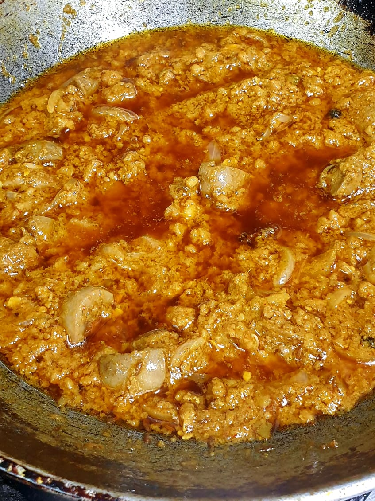

Servings: 2-3  
Cook Time: 30 mins  
Difficulty: Easy  

# Ingredients
* 250g goat liver, cut into half inch squares
* 150g goat kidneys, each kidney cut into 4 pieces
* 100g goat qeema, thickly cut
* 100ml mustard oil
* Red chile (_lal mirch_) powder, to taste
* Salt, to taste

### Hara Masala
* 1 big onion, for gravy
* 6-8 cloves of garlic (_laung_), for washing liver and kidney
* 1 tbsp fresh ginger garlic paste
* ½ medium tomato, for gravy
* 3-4 green thai chiles (_hari mirch_), for garnishing
* Dania leaves (_dhania ki patti_), for garnishing

### Sookha Sabut Masala
* 2-3 Bay leaves (_tez patta_)
* 4-5 cloves (_laung_)
* 8-10 whole black peppercorns (_kali mirch_)

# Directions
In 250ml water, crush garlic, add quarter tsp of salt. Soak liver and kidney in it till the time it is used (10-15 minutes).

Puree the whole onion. Puree half tomato seprately with 2 whole green chiles.

Roast Sabut masala for 2 minutes and then grind it.

Heat the oil in a thick bottom kadhai and mix in the Sookha Sabut Masala. Roast for 30 seconds. Add finely chopped onions and lightly brown it. Add 1 tbsp ginger garlic paste and stir it for another minute. Add pureed tomato and chiles, stir and cook for a minute. Then add ground Sookha Masala and cook it for 1 minute.

Add qeema and let it cook for 5 minutes in the gravy. Drain and add liver and kidneys to it and mix it well with the masala.

Cook everything with lid on for 5 minutes on high and then 15 min on simmer (keep checking and turning everything). Garnish with chopped green chiles and dhania leaves

# Tips
> This recipe goes best with Roghni or Kashmiri roti
