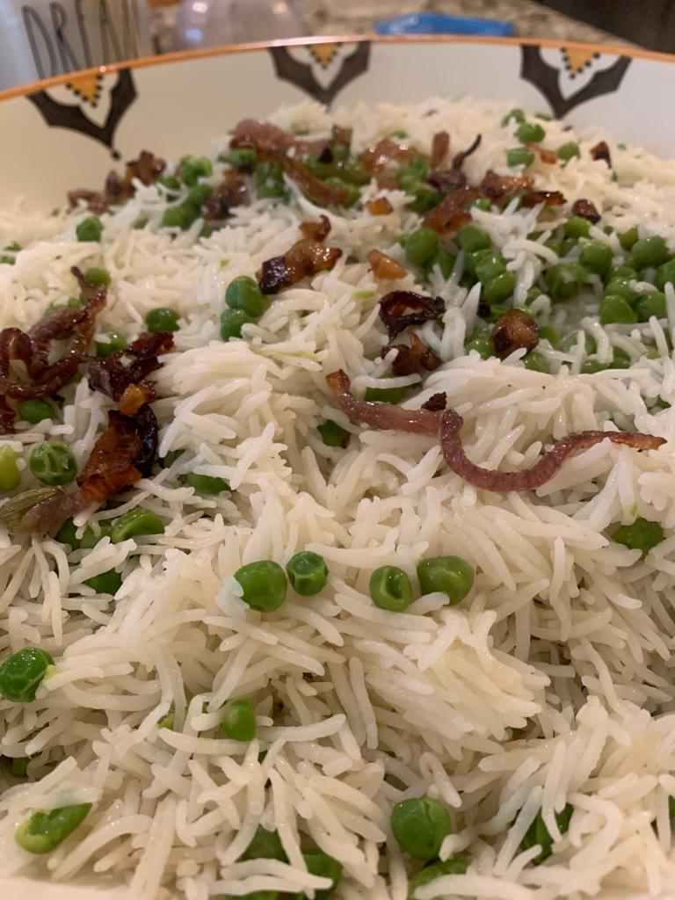

Photo Credit: Meher Rizvi

# Ingredients
* 1 kg basmati rice
* 1½ kg green peas, shelled (_matar dana_)
* 2 cloves (_laung_)
* 2 green cardamom pods (_elaichi_)
* 1 bay leaf (_tez patta_)
* 2 serrano peppers (_moti hari mirch_)
* Ghee 
* Salt, to taste

# Directions
Soak rice for 30 minutes. Put all aromatic masala in ghee in a pot (_patili_). Add matar and salt. 

When matar is half tender, add rice without water. Stir and add water to cover an inch above rice. Wait until the first boil then reduce the flame, cover lid and cook till tender.

# Tips
> Traditionally, this pulao is garnished with fried onion.
