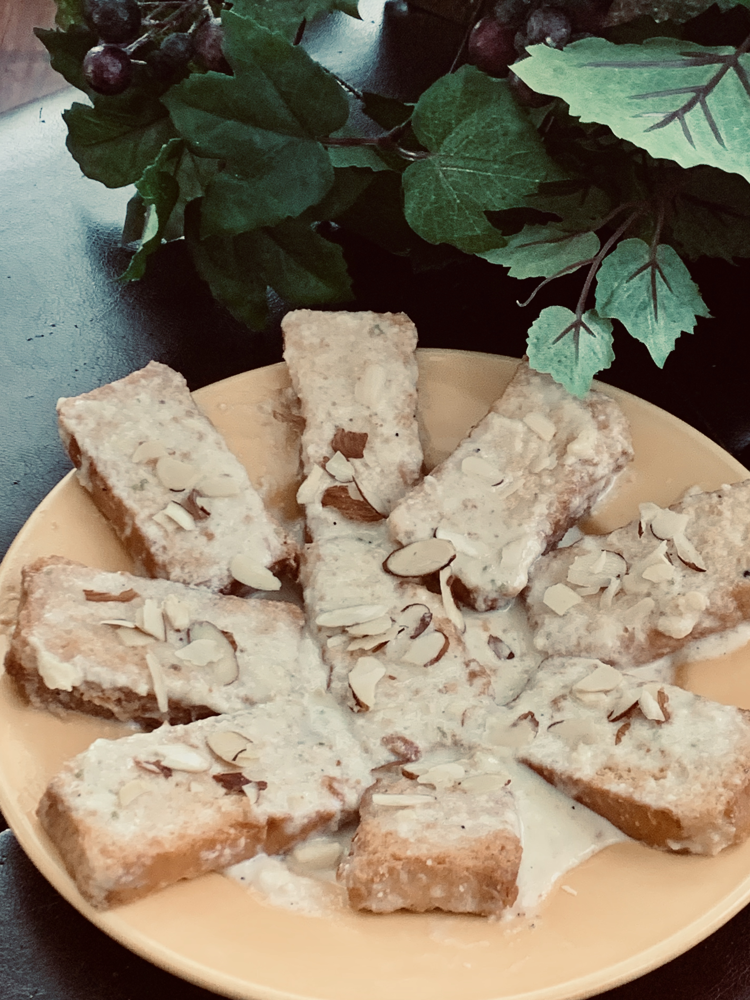

Photo Credit: Hala Jafri

Cook Time: 10mins

Don't have the time for the [original recipe](/shahi-tukda)? You can make Shahi Tukda in much less time with this recipe.

# Ingredients
* 12-15 small size elaichi rusk
* 2 cups milk
* ¾ can condensed milk (or sugar as per taste )
* ½ tsp cardamom powder 
* Few strands of saffron 
* Sprinkle of kewra water 
* Almonds for garnishing, optional 

# Directions
Arrange your rusks cookies in a serving bowl preferably a rectangular 8x11 size serving dish. Put the milk on boil. When slightly thickened add condensed milk. 

Boil until it is considerably reduced. Add elaichi powder, saffron and kewra at the end. Remove from stove. Pour over rusk. Garnish with almonds. Let it chill for 1-2 hours in the fridge. Enjoy!!!

# Tips
> If you want to speed up the thickening process, add 1 tbsp rice flour dissolved in 3 tbsp of your boiling milk. Add slowly and keep stirring in the pot.
