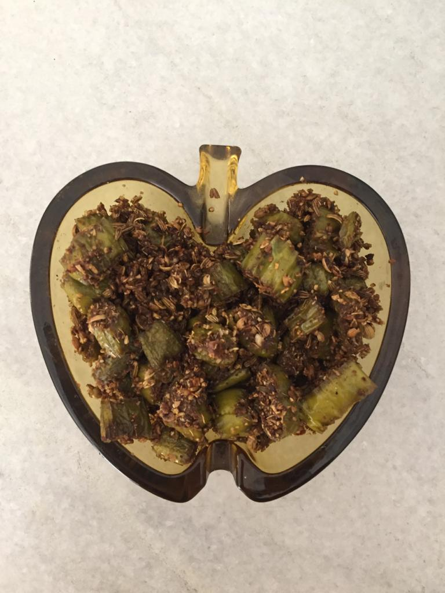

Difficulty: Easy  

# Ingredients
* 200g large green chillies 
* 4 tbsp coriander seeds (_dhania_)
* 4 tbsp fennel seeds (_saunf_)
* 2 tbsp dry mango powder
* ½ tbsp salt
* 1-1½ tbsp mustard oil or neutral oil plus extra for frying

# Directions
Wash and completely dry large green chillies. Slit lengthwise almost till the ends, leaving comfortable pocket space for stuffing, leaving seeds inside. 

If using mustard oil, boil it and let it smoke till it changes colour, then cool till warm. 

Dry roast only slightly coriander seeds, let cool. Dry roast only slightly fennel seeds, let cool. Coarsely grind both together, pulsing 4-5 times.

Put both on a plate, add dry mango powder, salt and first only 1 tablespoon oil. Mix with hand. If all ingredients are moistened with oil, don't add the extra ½ oil, else add it.

Stuff chillies with this, and be careful not to overstuff, else stuffing will fall out while frying and burn. 

In about 1½-2 tablespoons of oil fry chillies on very low heat with slit side up first, then turning over on sides carefully till peppers are evenly blistered, and slightly light brown. If necessary add a little more oil. 

Cool and enjoy! Goes well especially with Indian vegetarian food, particularly with a simple dal and rice combination.

# Tips
> If stuffing variety of peppers is not available, use regular chillies as an alternative. After mixing the spices with oil, cut regular chillies into ¼"-½" long pieces. Now fry the cut chillies and spices together in oil on very low heat like the large chillies for about 25 minutes turning after every couple of minutes or so.

> You may also prepare some extra spice, and keep handy in the fridge.
