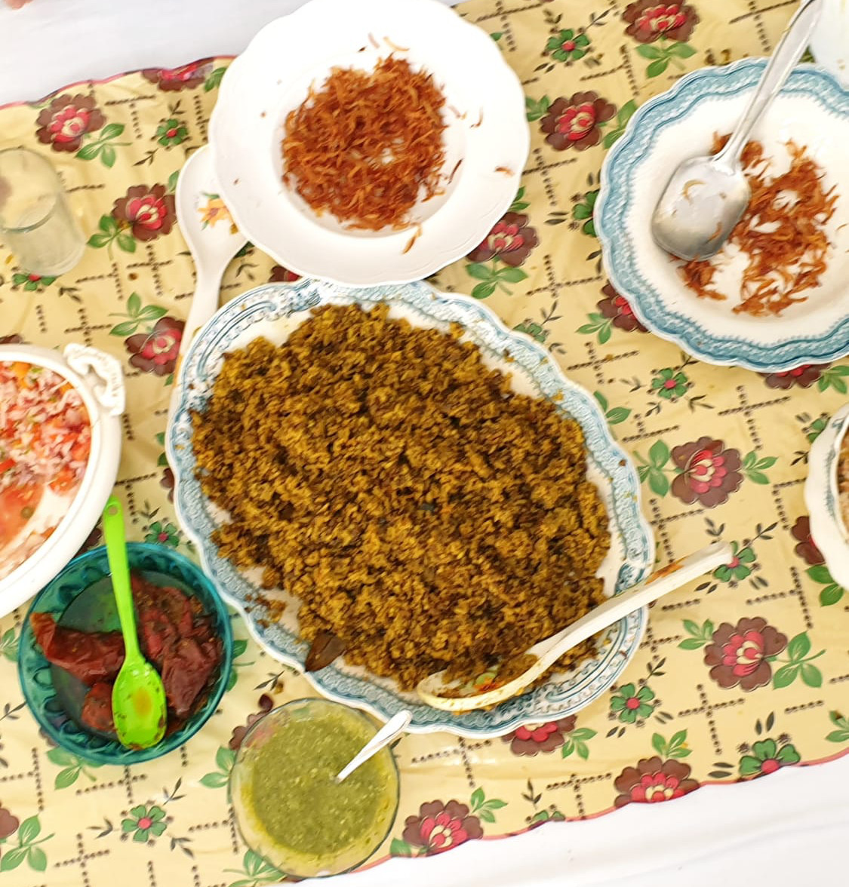

Difficulty: Medium\
Servings: 4-5  

# Ingredients

* 500g brown lentils
* 350g good quality basmati rice
* 6 tbsp oil plus 1 tbsp 
* 3-4 bay leaves (*tez patta*)
* 12-15 black peppercorns (*kali mirch*)
* 2 brown cardamom pods with skin (*badi elaichi*)
* 2 green cardamom pods with skin (*elaichi*)
* 2" cinnamon stick
* 5 cloves
* 1 tsp ground garam masala
* 2½ tbsp ground garlic
* 2½ tbsp ground ginger
* 2 large onions, chopped
* 2 medium onions, ground
* 3 tsp turmeric  
* 2 tsp ground coriander 
* 2 tsp salt plus 1½ tsp
* 2 tsp red chilli powder, or to taste
* hot water to fry the above ingredients 
* 1½ cups water to cook soft lentils after soaking
  * Alternatively, 2 cups water to cook not so soft lentils after soaking

# Directions

Wash well and soak lentils for 4 hours in drinking water, keeping water level at least 3" above the lentils. Now check to see (this is the tricky part) that when you press the lentil, if it becomes soft. If so, then your cooking time is 12 minutes, if not, then 15 minutes. Check difference in water quantity in the ingredients section above. 

Rice will be soaked only 20 minutes prior to its addition, so be aware of when to soak it. 

In pressure cooker put 6 tablespoons of oil, and on medium heat put in bay leaves, peppercorns, both cardamoms, cinnamon, and cloves. When they puff up a bit, add chopped onions and fry till a nice golden brown, stirring continuously. 

Add ground onions, garlic, ginger, turmeric, red chilli powder, 2 teaspoons salt, and coriander and fry by adding 2 tablespoons hot water when necessary till oil separates and the raw smell is completely gone. Somewhere in the middle of frying you will need to soak the rice, but only 20 minutes before adding to lentils, so figure out when. This is important since a pressure cooker is being used. 

Drain the lentils but reserve the water. Add drained lentils, and stir gently for about 5 minutes. For soft lentils, add 1½ cups water (using as much from the reserved lentil water as you can), cover, and turn up flame to high. After 1 whistle, reduce heat to simmer, and put timer on for 12 minutes. Switch off stove. For not so soft lentils, add 2 cups water, put on lid, turn up flame to high, and after 1 whistle, reduce to simmer, and cook for 15 minutes. Turn stove off.

Let pressure drop completely,  open lid, and very gently add rice, 1 teaspoon garam masala, 1½ teaspoons salt, and 1½ cups water. Before putting lid on, evenly sprinkle 1 tablespoon oil on top. Cook on high heat and after the first whistle reduce heat to simmer and cook for 7 minutes. Then turn stove off. Let pressure drop completely. 

Serve hot with crisp fried onions in ghee, raita of your choice, pickles, chutneys, fried poppadoms, etc. This is a simple dish, but has lots of accompaniments which make it very interesting and enjoyable!
