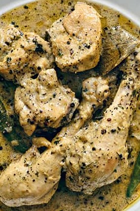

Servings: 4  
Prep Time: 40 mins  
Cook Time: 20 mins  
Difficult: Medium  

# Ingredients
- 1kg chicken, medium pieces, bone-in
- ½ tsp black pepper (_kaali mirch_) powder
- ¾-1 tbsp black peppercorns, crushed
- 1 tbsp lemon juice for marination
- 4-5 cloves (_laung_)
- 3-4 green cardamom pods (_elaichi_)
- 1-2 bay leaves (_tez patta_)
- 2 onions, finely chopped
- 300g yogurt, whisked
- 2-3 green thai chiles (_hari mirch_) (optional)
- 1 tbsp coriander powder (_dhania powder_) (optional)
- 1 tsp garam masala 
- 2-3 tbsp cream (optional)
- 100g butter
- 1 tbsp of ghee or oil
- 1 tsp dried fenugreek leaves (_kasuri methi_) (for smell, optional)
- Salt, to taste 

# Directions
Marinate chicken pieces with black pepper powder, salt and lemon juice for about 30 mins.

In a heavy bottom pan put butter and when it starts melting add oil so that the butter does not get that burnt brown colour. This should be done on medium flame.

Turn the burner to high flame add and fry chicken pieces turning around with soft hands so that they get the uniformed light brown colour without breaking. Take out and keep aside.

Put the cardamom pods, cloves, bay leaf and sauté for 10 seconds. Add onions and sauté until soft and translucent (avoid brownish colour). Add ginger garlic paste while onions are half done. Add dhania (if using it) sauté slightly.

Add whisked yogurt and stir till it starts blending with the masala. Add green chiles now if you want.

Add chicken and toss well with yogurt. Once the water of the curd starts diminishing add little bit of crushed peppercorns, stir and then add more. Add as much as you like.

Adjust the consistency according to your liking. If the chicken is not tender by now, add a little bit of water. Cover on low to medium flame.

If using cream and kasuri methi put both 5 minutes before you take your dish off the flame. The cream cuts the sour taste of yogurt and adds to the sauce.

Naushi jaan with rumali roti or phulka.

# Tips
> Dhaba cooks fry their chicken well and then keep adding the ingredients on high flame and keep tossing. They serve this latpata (slathered) masala style.

> Extending the marinating time to 2hrs will improve the taste.
