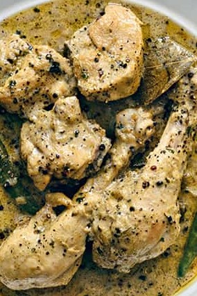

•	Recipe serving: 4
•	Prep Time: 10 mins
•	Marination Time: ½ hour
•	Cook Time: 15 - 20 mins
•	How Difficult: easy @ Home

**Ingredients** 
1 Kg Chicken (on bone – Medium pieces)
1/2 tsp black pepper powder
¾ - 1 tbsp black peppercorns (crushed)
1 tbsp lemon juice (for marination)
4-5 cloves
3-4 green cardamom 
1-2 bay leaf
2 onions – finely chopped
300 gms curd – (whisked)
2-3 green chillies (optional)
1 tbsp – coriander powder (optional)
1 tsp garam masala 
2-3 tbsp cream (if you want a little masala with chicken + to balance the sour taste of curd
100 gms butter 
1 tbsp of ghee / oil
Salt to taste 
1 tsp kasuri methi (for smell – optional)

> **Process**
> •	Marinate chicken pieces with black pepper powder, salt and lemon juice for approx. 30 mins (the more you do the taste definitely gets better (2- hrs)
> •	In a heavy bottom pan put butter and when it starts melting and oil (so that the butter does not get that burnt brown colour) – it should be done on medium flame.
> •	Turn the burner to high flame add and fry chicken pieces turning around with soft hands so that they get the uniformed light brown colour (without breaking). Take out and keep aside.
> •	Put the cardamoms, cloves, bay leaf and sauté for 10 seconds. Add onions and sauté until soft and translucent (avoid brownish colour) add ginger garlic paste while onions are half done. Add dhania (if using it) sauté slightly.
> •	Add whisked curd and stir till it starts blending with the masala add green chillies (if required) 
> •	Add chicken and toss well with curd … once the water of the curd starts diminishing add little bit of crushed peppercorns, stir and then add more, add as much as you like.
> •	Adjust the consistency according to your liking, if required use a little bit of water (if the chicken is not tender by now) cover on slow to medium flame. 
> •	If using cream / kasuri methi just put both 5 minutes before you take your dish off the flame (cooked covered) 
> •	Naushi jaan with rumali roti / phulka 

**Secret:**
The Dhaba people cook their chicken well when they are frying it and then keep adding the ingredients on high flame and keep tossing – served latpata masala style