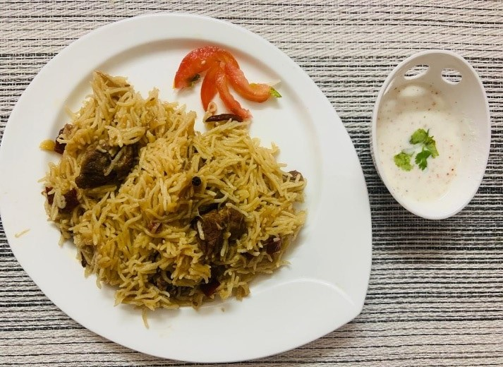

# Ingredients
* 700g basmati rice (soaked for 2 hrs.)
* 100ml oil or ghee
* 5-6 big onion 
* 5 cloves of garlic, finely chopped
* 1 inch piece of ginger, finely chopped
* 4 whole red chili, coarsely chopped
* 8 black peppercorns 
* 6 cloves 
* 2 green cardamom (_elaichi_)
* 1 black cardamom (_badi elaichi_)
* 1 bay leaf (_tez patta_)
* 1 tsp of Kashmiri red chili powder
* 1½ tsp salt, or per taste

# Directions
Pour the oil in a pressure cooker and add all whole spices mentioned above. Stir for few seconds then add finely sliced onions, chopped ginger and garlic and stir till the onion is slightly brown in color.

Add mutton pieces while stirring and add salt and Kashmiri red chili powder. Keep stirring till the raw smell of mutton goes away and oil is seen on the sides of pot. add water if required.

Now add 1½ cups of water and cook the mutton until its tender. When the mutton is done, open the lid add soaked rice into the cooker. After 2-3 whistles, lower the flame for 2 mins and then turn it of.

Serve with raita and salad.
