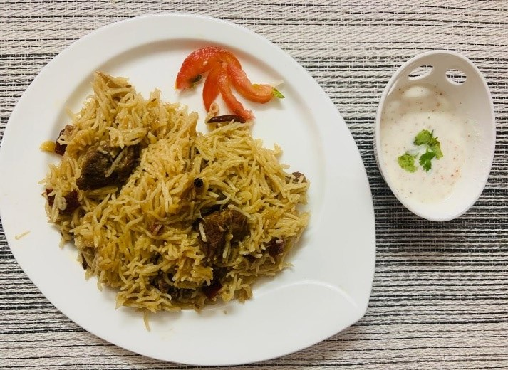

# Ingredients

* 700g Basmati Rice (soaked for 2 hrs.)
* 100 ml of oil /ghee
* 5-6 Big Size Onion 
* 5 cloves of Garlic (Finely chopped)
* 1-inch Ginger (Finely chopped)
* 4 whole Red Chili (coarsely Cut)
* 8 peppercorns
* 6 cloves 
* 2 Green cardamom
* 1 Black cardamom
* 1 Bay leaf
* 1 tsp of Kashmiri Red chili powder
* 1 ½ Tsp of Salt (According to Taste)

# Method

Pour the oil in a pressure cooker and add all whole spices mentioned above, stir for few seconds then add finely sliced onions, chopped ginger and garlic and stir till the onion is slightly brown in color .Add mutton pieces while stirring and add salt n Kashmiri red chili powder Keep stirring till the raw smell of mutton goes n oil is seen on the sides of pot (add water if required).

Now add 1 ½ cups of water n cook d mutton till its tender. When the Mutton is cooked open the lid add soaked Rice into pressure cooker after 2-3 whistle slow the flame for 2 min & turn off the flame.
It's ready to be served with raita and salad