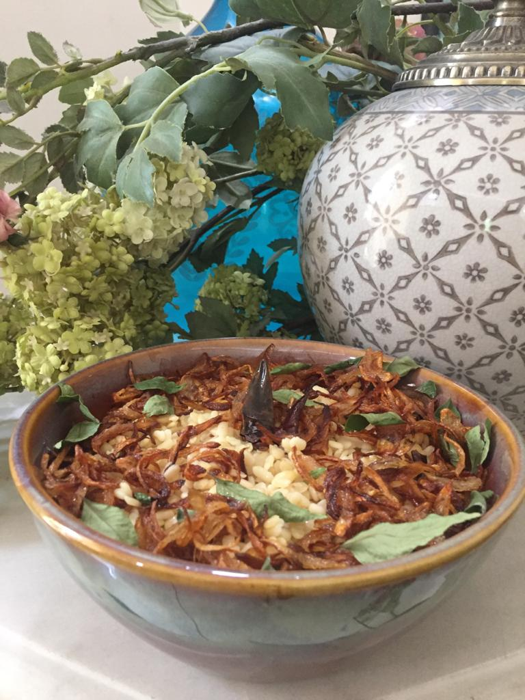

Servings: 4 people
Difficulty: Medium

# Ingredients

* 1 cup skinless urad/mash dal 
* 1 teaspoon finely chopped ginger
* 1 teaspoon finely chopped garlic
* 1 1/2 teaspoons neutral oil OR preferably melted clarified butter/ghee
* 2” whole red chilli cut into very thin slices(more optional)
* 1 teaspoon whole cumin
* 1 teaspoon salt
* 3/4 cup water that lentil was soaked in. 

### For tempering
* 2 tablespoons melted clarified butter/ghee preferably OR neutral oil
* 100 grams very thinly sliced onions for tempering
* 2 tablespoons cut mint OR green coriander.
* 1 finely cut green chillie (optional)

# Directions

Wash and soak urad/ maash lentil in 2 cups water for ONLY 20 minutes. Set your timer. Strain it, reserving 3/4 cup water for later use.

Meanwhile, in pressure cooker,  warm 1 1/2 teaspoons of ghee/oil, and fry ginger and garlic over low flame. When slightly more than golden, it is ready, and quickly add cumin and cut red chilli. When cumin splutters, immediately add soaked and strained lentil, else cumin could burn altering the delicate taste.

Stir lentil on medium high for 2 minutes.

Add 3/4 cup of reserved water, salt, and secure lid on cooker.

Turn up heat to high, and let cook.

After 2 whistles on high, turn down to lowest heat, simmer, and let cook for 5 minutes(use timer).

Turn off stove. 

Let pressure drop completely then open cooker. Gently stir lentils, placing the bottom ones on top. 

Spoon onto serving plate.

In a small frying pan put 2 tablespoons ghee/ oil, and on medium heat fry onions till golden, reduce heat to simmer, and fry till dark golden and crispy. When ready pour at least 1 tablespoon ghee and all onions evenly over lentil,  or then all of ghee, depending on the richness you prefer.

Secondly, sprinkle coriander OR mint, along with thinly cut green chillies(optional).

Enjoy !
