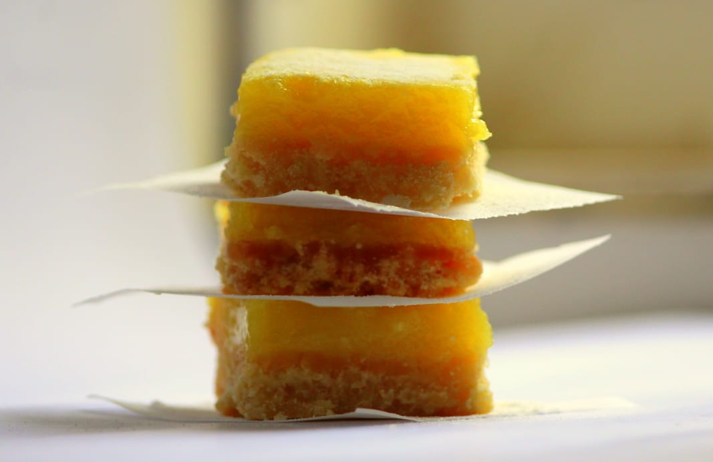

# Ingredients

### For the base
* ½ cup butter
* ¼ cup sugar  
* 1 cup all purpose flour

### For the filling
* 2 eggs (room temp)
* ½ cup sugar
* 2 tbsp all purpose flour
* ¼ cup lemon juice 
* 10 drops of yellow food colour

# Directions
Preheat oven to 175C.

Line a 6x6 inches pan with parchment paper.

Combine all three ingredients for the base. Knead it into a smooth dough. Place the dough in the pan and flatten it out with your fingers till it spreads evenly throughout the pan.

Bake for 15-20 mins or till the edges of the base turn a light brown colour. Take it out of the oven and pour the filling on it and place it back in the oven for 15 mins or till the filling firms up (doesn't jiggle in the centre).

While the base is getting baked in the oven, prepare the filling. Whisk the eggs. Add sugar, lemon juice and flour. After a few gentle whisks add colour. 

Whisk gently till sugar dissolves and it becomes a a smooth filling. 

Take out of the oven and let it cool down to room temp before placing it in the fridge in an air tight container for 3 hours atleast.

Cut into 16 squares and enjoy cold. They taste best cold.

# Tips
> Every oven is different so please keep checking as the timings may differ.
