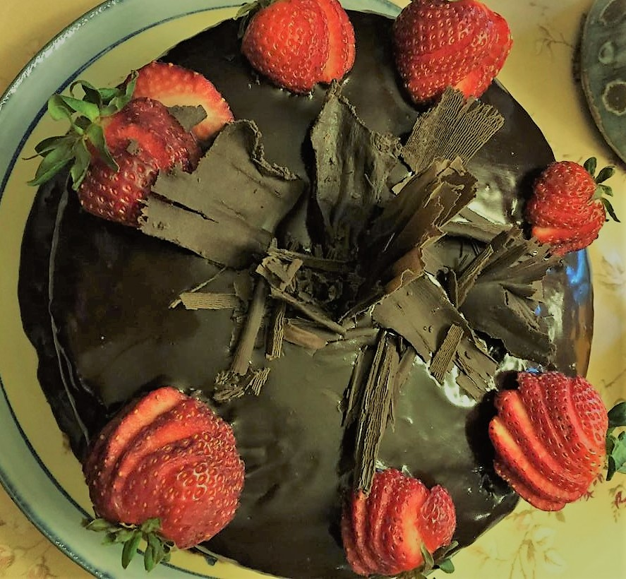

Difficulty: Easy\
Cook Time: 40 mins  

Vegan options noted where applicable.

# Ingredients

* 2 cups flour
* 1¼ tsp baking soda
* ½ tsp salt
* 2/3 cup butter plus 3 tbsp (Vegan option: ½ cup oil plus 6¾ tsp)
* 1¾ cup sugar
* 1 tsp vanilla
* 2 eggs (Vegan option: 2 tbsp chia seeds ground in 6 tbsp water)
* 9 tbsp unsweetened good quality cocoa powder
* 1¼ cup cold water

# Method

Grease and flour two 9½" baking tins. If using chia seeds, process chia and water till well blended and let congeal.

Mix first three ingredients plus cocoa powder. Keep aside.

In bowl beat butter/oil on medium for 30 seconds. Add sugar and vanilla, and beat till well combined.

Add eggs one at a time, beating for 1 minute after each egg. If using chia seeds, add now and beat for two minutes.

Add dry ingredients and cold water alternately beating after each addition. Turn into pans and bake at 350F for 30-35 mins.

Use frosting if desired.