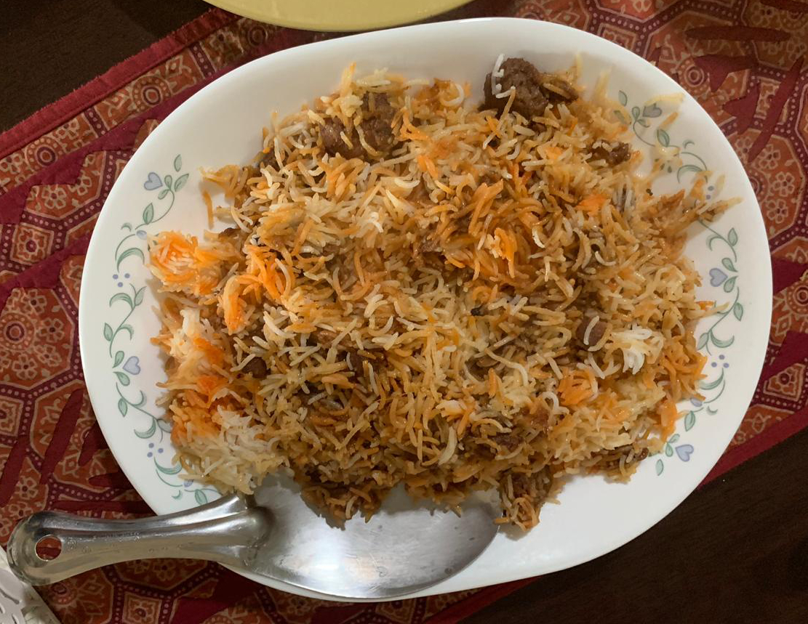

Recipe Credit: Reza Rizvi (via Nayaz Bhai)  
Photo Credit: Sameera Rizvi  
Difficulty: Hard  

# Ingredients

* 500g mutton 
* 500g onions (sliced)
* 100g yogurt 
* 2 tbsp ginger paste
* 2 tbsp garlic paste 
* 1½ tsp red chile powder 
* 250g oil or ghee
* 3-4 cloves (*laung*)
* 3-4 green cardamoms (*elaichi*)
* Salt, to taste 
* 750g basmati rice 
* ¼ tsp orange food colouring
* 4-5 tbsp milk

# Preparation

In a pressure cooker heat oil and brown the onions. When lightly browned add the cloves and cardamom cook for a few seconds then add the meat. Cook till the meat changes colour.

Add ginger garlic paste cook for another 8-10 minutes on medium heat. Add in the salt red chile powder and the yogurt. Keep stirring till the water dries up. Add about 1.5 cups of water and cook till the meat is tender (approximately for 15 minutes on low flame after the first whistle). Once the meat has cooked through, dry any remaining water on high flame. You should have a thick gravy now.

Soak rice for 20 minutes. Boil it in water with salt cloves and cardamoms until it’s nearly cooked. The rice should break into two parts between the fingers. Drain excess water.

Divide the rice into two parts. Layer the rice at the bottom of the pot then add a layer of the mutton gravy (*yakhni*) over it, but save some for later. Then add the remaining rice over the mutton layer. Mix orange colour in milk and sprinkle over the rice also the pour the remainder of the gravy over the rice.

Cover the lid tightly and let the rice cook on low flame for 10 minutes.

# Tips

> Serve hot with raita.
