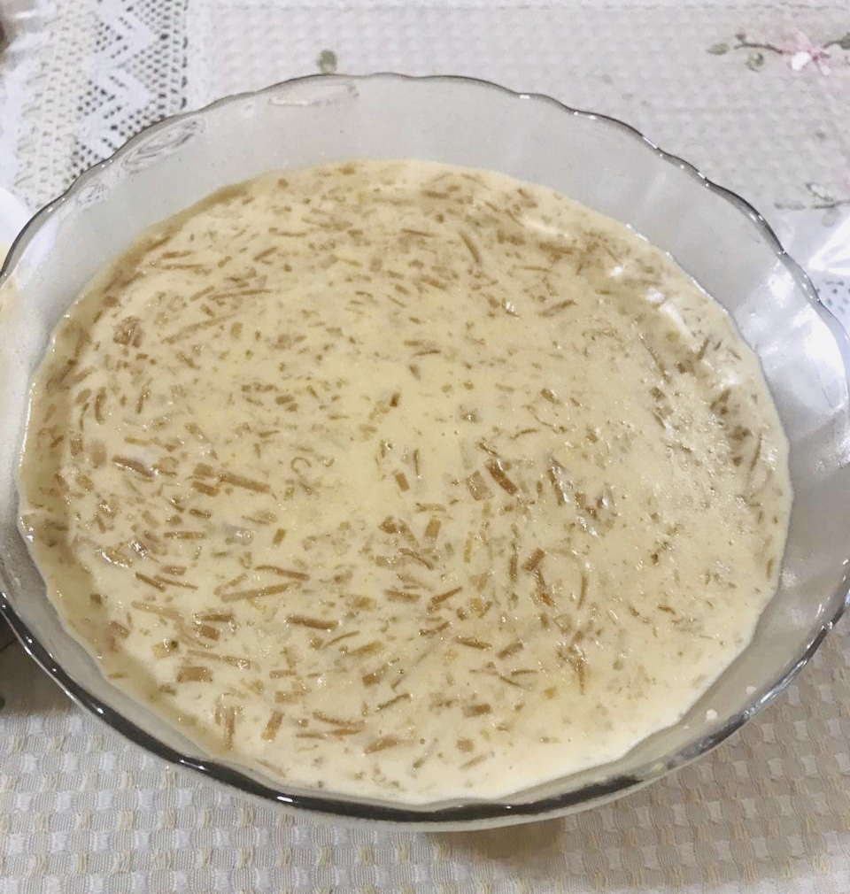
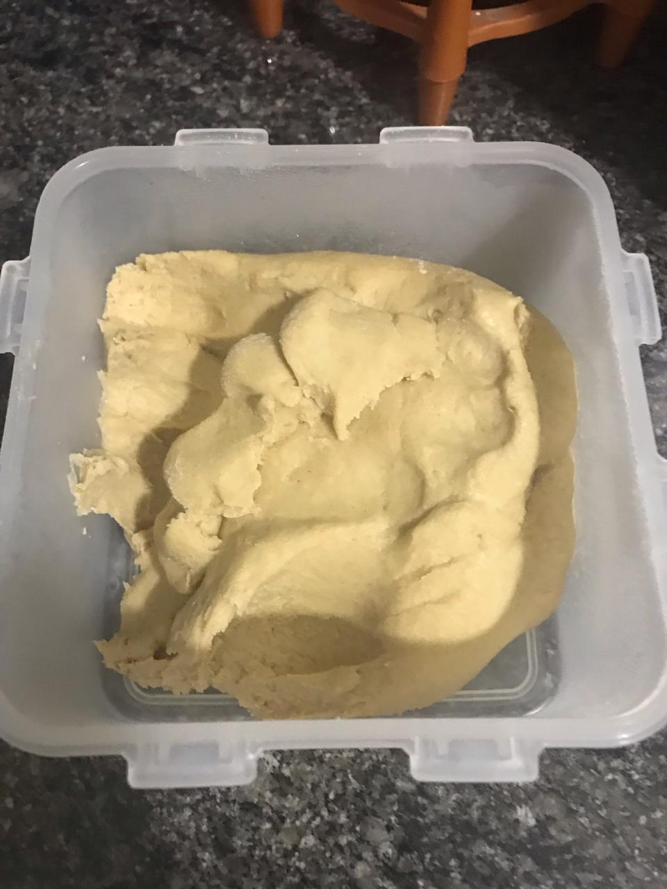
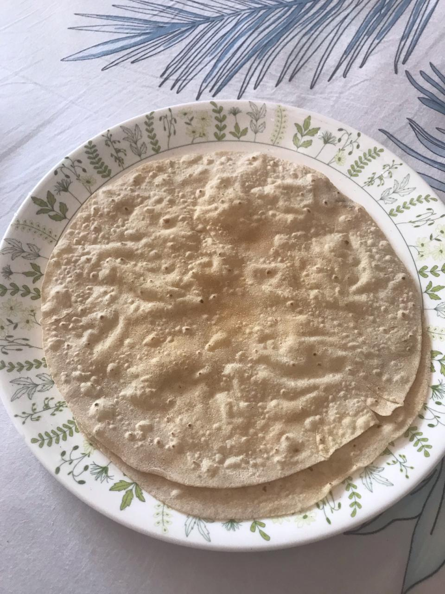
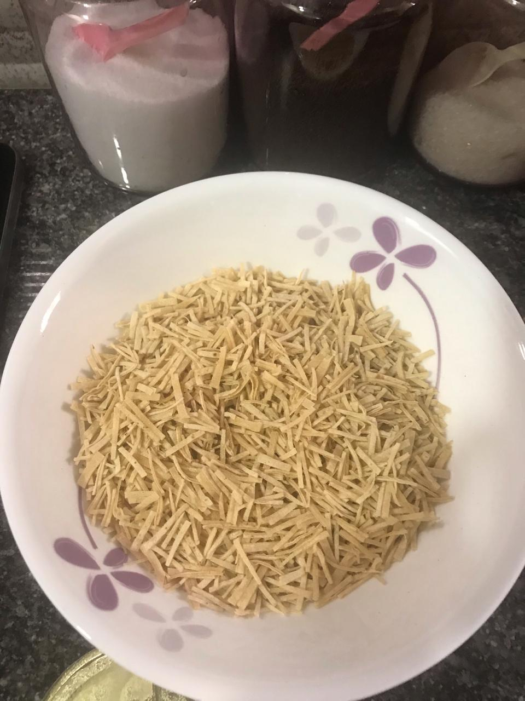
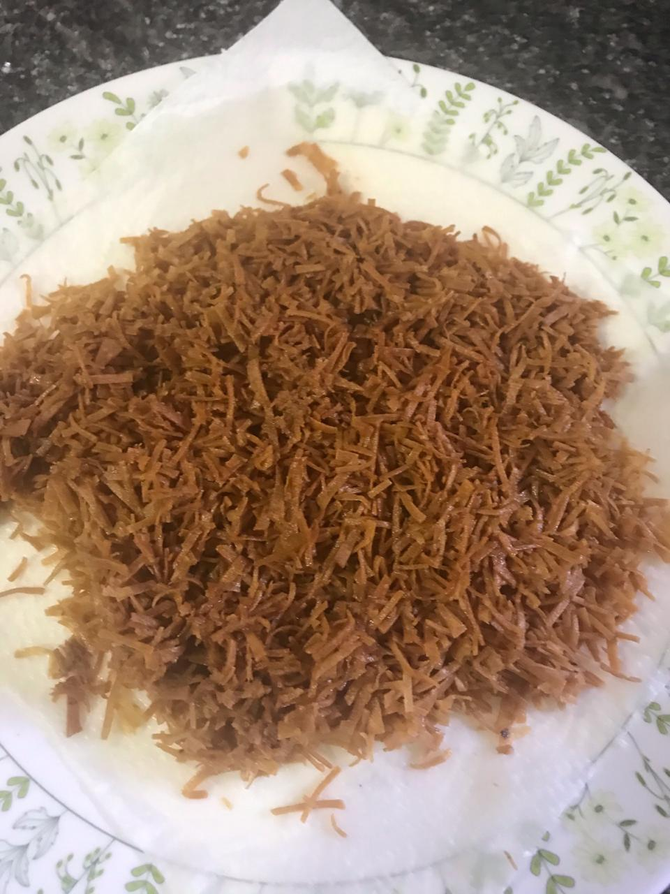
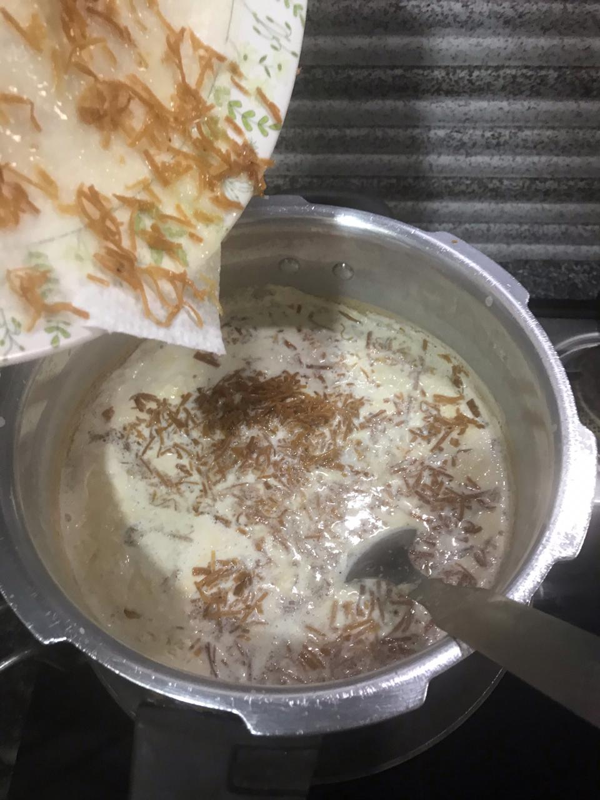
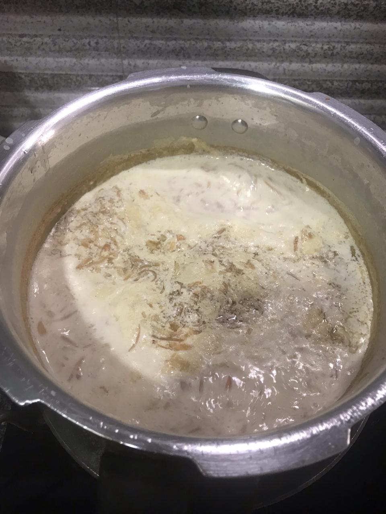

Photo Credit: Fehmina Zaidi  

# Ingredients
* 3 liters whole milk
* Flour for 4-5 chapatis (flatbread)
* Ghee, for frying
* 1-2 cups sugar, or to taste

# Directions
Boil the milk until it reduces a little and keep it aside.

Sieve normal whole wheat flour through a cotton mulsin (_mulmul_) cloth. Knead this flour and form a soft dough. 

Using a rolling pin make thin chapatis (flatbread). We will need 4-5 of these chapatis.

Heat griddle (_tawa_) on gas and semi cook these chapatis from both the sides just enough that the chapati comes in hand. Do not overcook it. Cool and cut the chapatis fine (first cut the chapati into halves, then the halves cut in quarter, each quarter into strips and then cut each strip finely).

Heat ghee in a wok and when warm fry these chapatis till a nice pink colour is attained. Place on a kitchen towel to absorb the excess fat.

Heat the milk again and once hot put these fried chapati into it and let it cook. 

Keep cooking till the chapati pieces turn soft in it and the milk starts thickening. As it thickens add sugar to it and stir continuously till the sugar dissolves. 

When the desired consistency of the kheer is reached turn off the gas. Put few drops of Kewra and cover the pot.

Pour the kheer into a serving bowl and allow it to cool. Once cool keep in the fridge to let it set. Before serving put silver leaf (_chandi ka waraq_) and garnish it with almond and pistachio (optional).
