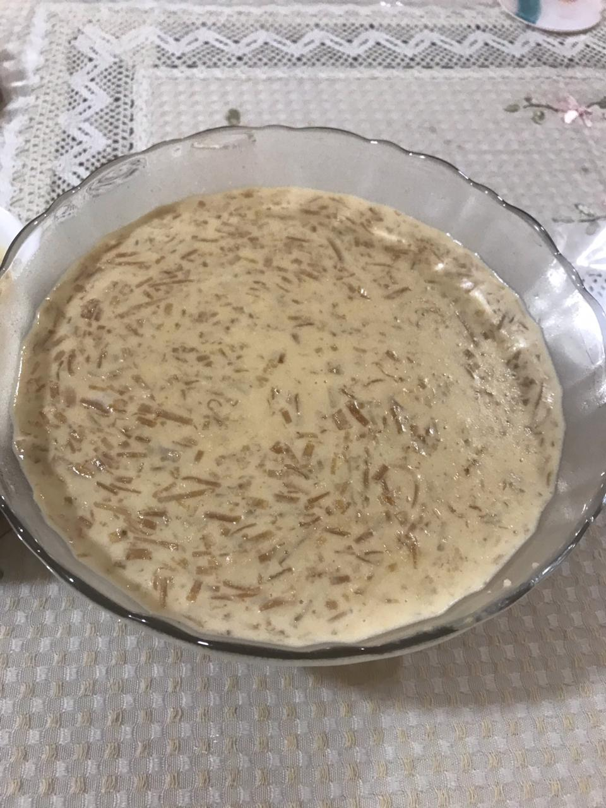

# INGREDIENTS

* Milk - 3L 
* Chapati-4/5 depending on the size
* Ghee to fry
* Sugar- 1-2 cups or as per taste

# METHOD

* Boil 3L of full cream milk till it reduces a bit and keep it aside
* Sieve normal whole wheat flour through a mulmul cloth to get refined flour
* Knead this flour and form a soft dough
* Using a rolling pin make thin chapatis 4/5 
* Heat tava or griddle on gas and semi cook these chapatis from both the sides just enough that the chapati comes in hand,do not over cook it.
* Cool and cut the chapatis fine( first cut the chapati into half,then the halves cut in quarter,each quarter into strips and then cut each strip finely) 
* Heat ghee in a wok and when warm fry these chapatis till a nice pink colour is attained.Remove on a kitchen towel to absorb the excess fat
* Heat the milk back and once hot put these fried chapati into it and let it cook
* Keep cooking till the chapati pieces turn soft in it and the milk starts thickening.
* As it thickens add sugar to it and stir continuously till the sugar dissolves in it
* When the desired consistency of the kheer is reached turn off the gas
* Put few drops of Kewra and cover the pot 
* Pour the kheer into a serving bowl and allow it to cool.
* Once cool keep in the fridge to let it set.
* Before serving put chandi ka warq and garnish it with almond and pistachio (optional)