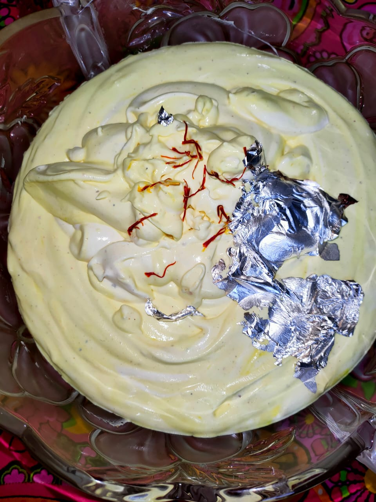

# Ingredients:

* 1.5L whipping cream
* 1.5 boxes badam shake powder 
* 190g powdered sugar or to taste
* 2 pinches of saffron soaked in very little water 

# Method

  Beat whipping cream, powdered sugar, badam mix and saffron on high until stiff peaks form. Garnish with a few strands of saffron and some silver leaf.