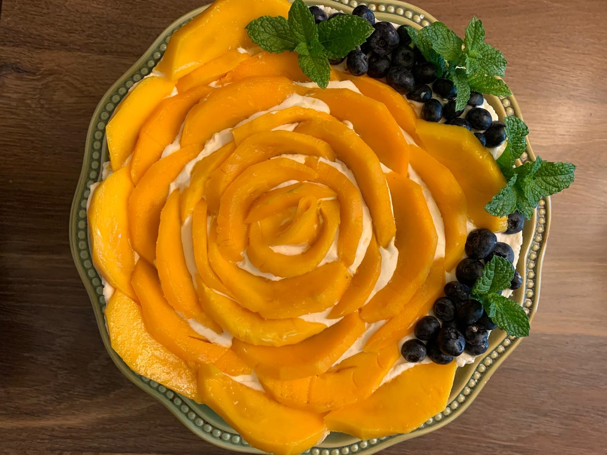

# Ingredients
* 3 medium size mangoes, thinly sliced
* 500g mascarpone cheese
* 600 ml thickened cream or heavy whipping cream 
* 3-4 tablespoon caster sugar 
* 250g Savoiardi biscuits (lady fingers) 
* 1 tsp vanilla essence
* 1 cup mango nectar (or orange juice)
* 2 egg yolks
* Line base of 20 or 22 cm springform cake pan

# Directions

Whisk cream. Add sugar and vanilla essence and whisk to combine.

Add mascarpone cheese & egg yolks; whisk to combine.

Dip saviordi biscuits in mango nectar and arrange in the base of the cake pan. Spread half of the cream cheese mixture on to the biscuits. Top with mango slices.

Repeat for the second layer of biscuits — dip in mango nectar, spread the cream cheese mixture and top with mango slices.

Refrigerate overnight. Carefully remove the sides and serve chilled Mangomisu.
