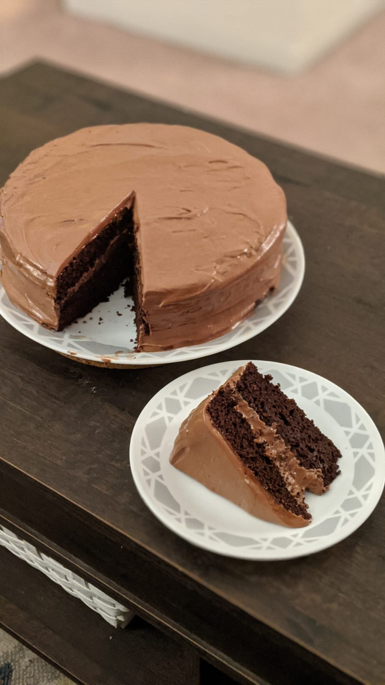

# Ingredients

### For the cake
* butter and flour for coating and dusting the cake pan
* 3 cups all-purpose flour
* 3 cups granulated sugar
* 1½ cups unsweetened  cocoa powder
* 1 tablespoon baking soda
* 1½ teaspoons baking powder
* 1½ teaspoons salt
* 4 large eggs
* 1½ cups buttermilk
* 1½ cups warm water
* ½ cup vegetable oil
* 2 teaspoons vanilla extract

### For the frosting

* 1½ cups butter softened
* 225g cream cheese softened
* 1½ cups unsweetened cocoa powder
* 3 teaspoons vanilla extract
* 3-4 cups powdered sugar
* about ¼ cup milk as needed

# Directions

## For the cake

* Pre-heat oven to 350°F (177°C). Butter 2 9 inch cake rounds. Dust with flour and tap out the excess.
* Mix all the dry ingredients together: flour, sugar, cocoa, baking soda, baking powder, and salt. Mix them until combined.
* Add eggs, buttermilk, warm water, oil, and vanilla. Mix until smooth. This should take just a couple of minutes.
* Divide batter into the 2 pans.
* Bake for 30-35 minutes in the oven until a toothpick inserted into the center comes out clean.
* Cool on wire racks for 15 minutes and then turn out the cakes onto the racks and allow to cool completely.
* Apply frosting between layers and then all around.

## For the Frosting

* In a large bowl, mix together butter and cream cheese until fluffy.
* Add in cocoa powder and vanilla extract. Mix until combined.
* Mix in powdered sugar, 1 cup at a time. Add milk as necessary to make a spreadable consistency. The frosting should be very thick and will thicken even more if refrigerated.
