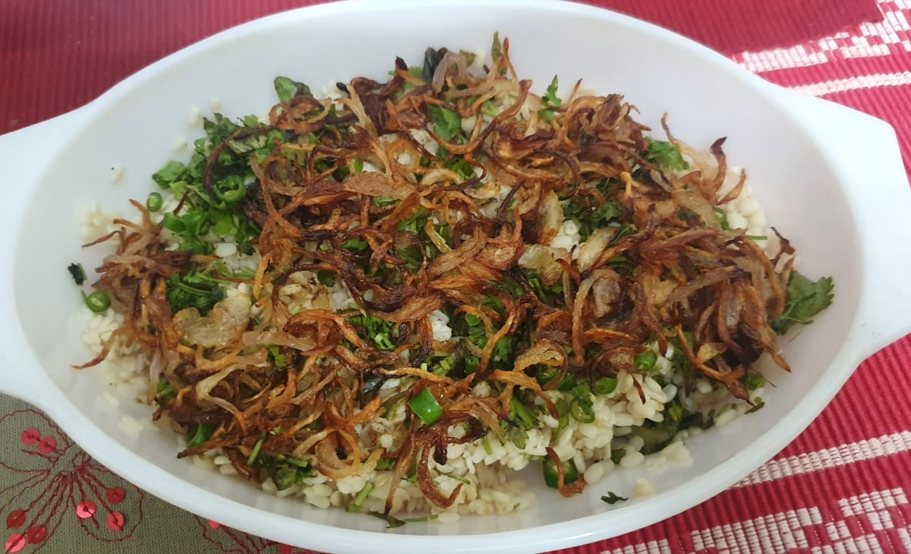

Difficulty: Easy  

# Ingredients
* 1 cup urad daal
* 1 tbsp grated ginger 
* ¾ cup roughly chopped mint 
* 2 sliced green chillies, or to taste
* 1 medium size onion, thinly sliced 
* ½ tsp freshly crushed black pepper 
* 2 tablespoons clarified butter (_ghee_), for frying onions
* Salt, to taste

# Directions

### If using a pot
Soak urad daal for 2-3 hours.

In a broad pan add 2 cups water, ginger, salt, and urad daal. Boil till its tender, but there is still water in it. It may take 35-40 minutes. Daal should be separate.

Drain the water well, and spread on a sieve for it to be completely dry.

Garnishing given below

### If using a pressure cooker
Boil daal in cooker with 1½ cups of water. After one whistle, reduce the flame and leave it for 3-4 minutes. 

Then take it off the flame, open once pressure drops, and check the daal.

Place in big sieve and let water drain completely. 

### Assembly
In a platter spread the daal. Check the salt. If you feel it's less, add now and mix well.

Fry onions to a nice golden colour. Once ready, pour evenly on daal. Sprinkle ground pepper, sliced green chillies, and chopped mint. 

Serve hot with chapattis.
