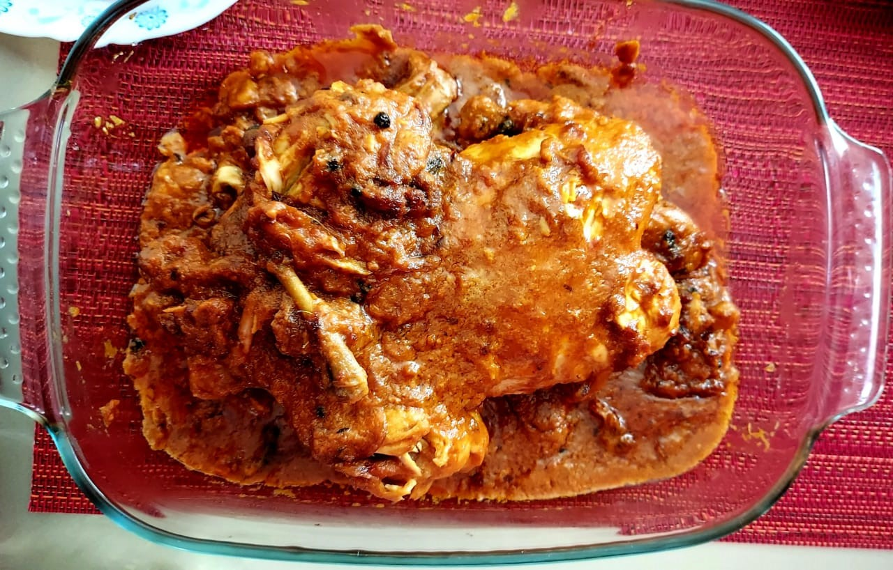

# \# INGREDIENTS: -

* 1 Piece of whole chicken (1000 Gram)
* 1 cup curd
* ½ Cup oil
* 4 Big Onions
* 4-5 large cloves of Garlic
* 1 Tsp of Red Chili Powder
* 1 Tsp of Coriander Powder
* 1 Tsp of salt (According to Taste)
* 1 inch of Ginger
* 8-10 Almonds
* 8-10 Cashew nuts
* 1 Tbs of Raisins
* 1 Tbs of Poppy seed (khus khus) / Sesame seeds
* Soak Dry fruits in water
* Whole Spices (Garam Masala)\*\*
* 1 Black Cardamom, 2-3 Green Cardamom, 5-7 Black Pepper,4-5 Cloves, Bay leaves, ½ inch cinnamon

### PREPARATION

Marinate chicken with 1 cup curd and set aside for 4-5 Hrs.

Fry 2 onions till Golden Brown color and keep aside.

In a Grinder Grind 2 Onions, Ginger & Garlic into fine Paste.

Then Grind all the soaked dry fruits mention above into paste n keep aside.

# METHOD

Pour oil in pressure cooker then add all whole spices (Garam Masala).Let it splutter add onion, ginger n garlic paste into it. Add a little ground dry fruit paste & rest keep for filling inside chicken. Add Red chili powder, coriander powder ,and salt & cook the masala till the oil separates.

In the meantime, fill the ground  dry fruit paste &1 boiled egg inside the chicken and tie the legs together with the thread so that paste n egg filled inside doesn’t comes out.

Now put Marinated chicken filled with Egg & Dry Fruit filling inside the pressure cooker and on top , add the golden fried onions add very little water because curd will release water now close the lid of pressure cooker.After 4-5 whistles slow the stove for 3-4 min and turn off the Flame. Open the Lid and cook till excess water evaporates

**Dish is ready to serve!**