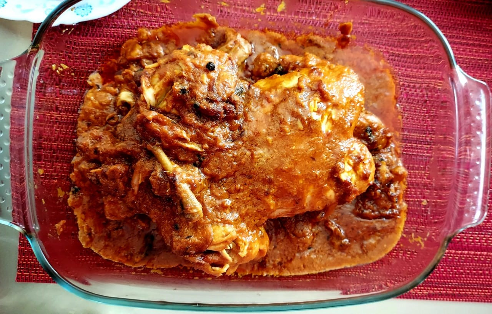

# Ingredients
* 1 whole chicken (1kg)
* 1 cup yogurt
* ½ cup oil
* 4 big onions
* 4-5 large cloves of garlic
* 1 tsp red chile (_lal mirch_) powder
* 1 tsp coriander (_dhania_) powder
* 1 tsp salt, or per taste
* 1 inch piece of ginger
* 8-10 almonds
* 8-10 cashew nuts
* 1 tbsp raisins (_kishmish_)
* 1 tbsp poppy seed (_khus khus_) or sesame seeds (_til_)
* Soak Dry fruits in water

### Garam Masala
* 1 black cardamom pod (_badi elaichi_)
* 2-3 green cardamom pods (_elaichi_)
* 5-7 black peppercorns (_kali mirch_)
* 4-5 cloves (_laung_)
* Bay leaves (_tez patta_)
* ½ inch cinnamon (_dalchini_)

# Preparation

Marinate chicken with 1 cup yogurt and set aside for 4-5 hrs. Also soak the dry fruits (nuts) in water.

Fry 2 onions until golden brown and keep aside.

In a grinder, grind 2 onions, ginger and garlic into a fine paste.

Then grind all the soaked dry fruits mention above into paste and keep aside.

# Directions

Pour oil in pressure cooker then add all whole spices (Garam Masala). Let it splutter and then add onion, ginger and garlic paste into it. Add a little ground dry fruit paste and set the rest aside for filling inside chicken. Add red chile powder, coriander powder and salt and cook the masala until the oil separates.

In the meantime, fill the ground dry fruit paste and 1 boiled egg inside the chicken and tie the legs together with the thread so that paste and egg filled inside do not poke out.

Now put the chicken inside the pressure cooker and on top add the golden fried onions add very little water because the yogurt will release water. Now close the lid on the pressure cooker. After 4-5 whistles lower the flame for 3-4 min and then turn it off. Open the lid and cook until all excess water evaporates.

The dish is ready to serve!
