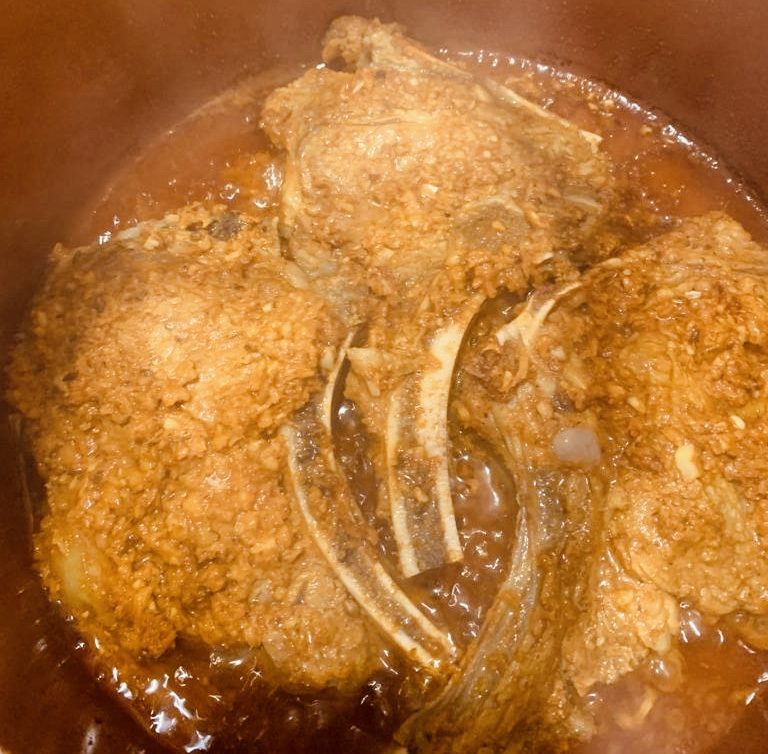

# Ingredients

* 1 kg mutton chops
* 1½ tbsp ginger (*adrak*) paste
* 1½ tbsp garlic (*lehsun*) paste
* ½ tsp turmeric (*haldi*) powder
* 1 tsp garam masala
* 2 tsp roasted coriander powder (*dhania powder*)
* 1 tsp cumin (*zeera*) powder
* 1 tsp chaat masala
* 3-4 tbsp yogurt (*dahi*)
* salt, to taste
* red chile (*lal mirch*) powder, to taste
* ¾ cup oil

### For Garnishing

* Onion
* Mint
* Green chile (*hari mirch*)

# Directions

Marinate the chops in ginger paste, garlic paste, salt, red chile powder, haldi, garam masala, dhania powder, zeera, chaat masala and yogurt. Keep for 2-3 hours at room temperature, or overnight in the fridge.

Take a pan or pot with lid and heat the oil in it. Put in the chops along with the marinade. Stir for 2-3 minutes and then cover and let it cook for 20-30 minutes (depending on the cut of the meet and the pot), stirring only once or twice in between. When mutton becomes tender (be careful not to overcook) then incover and stir until it becomes dry.

Garnish with onion, mint and slit green chile.