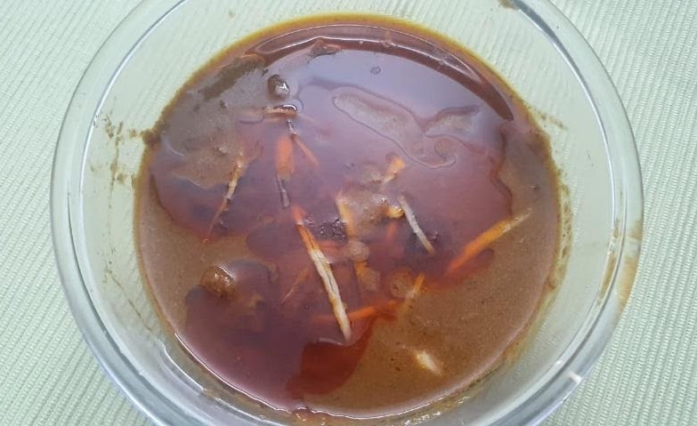

Servings: 4\
Prep Time: 15-20 mins\
Cook Time: 3 hrs\
Difficulty: Hard

Nihari is a stew from the Indian subcontinent made by slow cooking meat, preferably shank meat of
beef, lamb or mutton, along with bones.

# Ingredients
* 750g big cuts (6 – 7 pieces only) of mutton or beef
* 250g bones

### For the masala
* 2 tbsp crushed ginger, crushed (or ground to a paste)
* 1½ inch piece of ginger, julienned for garnishing
* 2 tbsp crushed garlic
* 3 medium onion, sliced then sautéed until golden brown, and then ground
* 3 - 4 green chillies (_hari mirch_), de-seeded and chopped
* 1 tbsp fresh coriander (_dhania ki patti_), chopped
* 2 tsp deghi mirch (or _kashmiri lal mirch_) powder
* 1 tsp red chilli powder (_lal mirch_)
* 1 tsp turmeric powder (_haldi_)
* 3 tsp coriander (_dhania_) powder
* 1 tsp garam masala
* 1 tbsp lazzat-e-taam
* 2 tbsp nihari masala (Shaan or any other)
* ⅙ tsp cinnamon powder
* 100g yogurt
* 2 tbsp gram flour (_besan_), dry roasted
* 1 tbsp AP flour (_maida_)
* 1 tsp lemon juice
* ¼ tsp kewra water
* 200ml mustard oil (preferred) or refined oil
* 2 tbsp Salt, or to taste

### Khushbu masala 
* 2 bay leaves (_tez patta_)
* ½ tsp black peppercorns (_kali mirch_)
* 4-6 green cardamom pods (_elaichi_)
* 5-7 cloves (_laung_)
* 2 mace flower (_javitri_)
* 1 nutmeg (_jaiphal_)
* 1 cinnamon stick (_dalchini_)

# Directions
Roast the khushbu masala lightly, and ground to a powder.

In a heavy bottom pan heat mustard oil to its boiling point and then take the pan away in open area and put in some garlic water to clarify. Be careful as the oil might splash. Add onion and fry until golden brown, drain, remove, grind to a paste and keep aside.

Add bones and the pieces of meat and sauté till natural water starts drying up and a little
brownish colour starts covering the pieces. Add ginger, garlic, salt and sauté well for some time till the masala starts sticking to the pan. Then add deghi mirch, sauté slightly and add water, a little at a time, and sauté well.

Meanwhile take ¼ cup water add and soak, turmeric powder, coriander powder, red chili powder
along with salt for 5 mins. In household terms, this is called _masala phulana_, which literally
meant that the soaked masala would absorb water. This is done to avoid the burning of any dry
masalas and the soaked masala would sauté well.

Sauté the masala and keep on stirring and slowly start adding water, say about 2 to 3 cups. Be
generous with water and do not worry about consistency right now. Cover and cook for at least 1½
hours on slow or medium flame (preferred) for 45 mins in a pressure cooker. After first 2
pressure releases on high flame put on medium flame.

Meanwhile take the fried onion paste and add a little water to make a watery textured paste. Add roasted
gram powder, garam masala, Lazzat-e-taam, nihari masala. If you can’t get Lazzat-e-taam – don’t
worry – it is actually just a flavour enhancer. Mix well, sieve and and keep aside. It should be a smooth watery mixture.

Remove oil as much as you can (mixing of gram flour and then flour would absorb all oil). Blend well
the yogurt and mix it in the gravy (on medium to high flame). Again, sauté well till the texture is smooth and well blended.

Mix the fried onion paste and again sauté well for about 8 to 10 mins.

Meanwhile make a watery blend mixture of all-purpose flour in about 1 cup water. Use a sieve
and mix this slowly and keep stirring till the flour blends in the gravy - it will start settling to the bottom if not mixed thoroughly.

Add more water (about 2 cups) keeping in mind that the water would be absorbed and the gravy would be thicker than it is usually in other dishes.

Cook covered (do not use pressure now if cooking in pressure cooker) on slow to fire for another 10 –
15 mins.

Meanwhile heat up the removed oil adding 1 clove, 1 green cardamom, chopped and deseeded green
chillies.

### Serving options

1. Add the oil, cinnamon powder, kewda water in the gravy, cover and keep for 5 mins with
out fire.
2. Add just the cinnamon powder, kewda water, cover and leave for 2 -3 minutes without
fire, dish out and put the hot oil on top as required.

The oil is an essential part of serving this dish as it incorporates all the flavour of masalas used along with the colour of deghi mirch and red chillies used.

Garnish with ginger juliennes and green coriander leaves, serve with khamiri roti, kulcha (Lucknow
style) for better taste. You can use any form of bread that soakes up the gravy.

# Secret
> The long slow cooking enhances the texture of the gravy.
