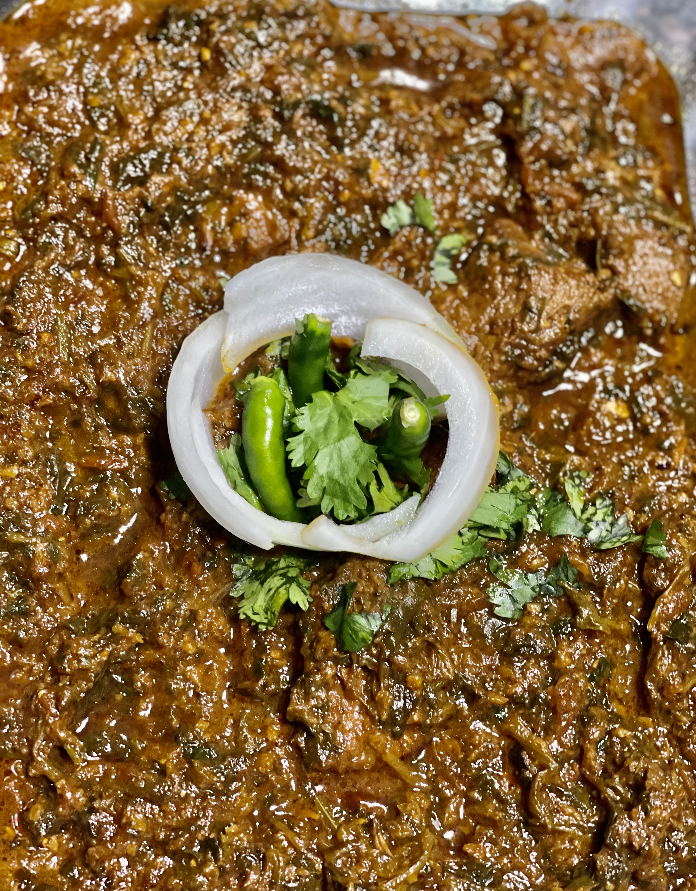

Difficulty: Medium  

# Ingredients

* ½ kg mutton
* 1 kg fresh spinach (*paalak*)
* 2 medium onions, sliced
* 2 medium tomatoes, chopped
* 1 large onion, ground to a paste
* 1½ tsp garlic paste
* 1½ tsp ginger paste
* ¼ cup oil
* Salt, to taste
* ½ tsp red chile powder
* 1½ tsp coriander powder (*dhania powder*)
* ½ tsp cumin (*zeera*) powder
* ½ tsp turmeric (*haldi*) powder
* 1 cinnamon stick (*dalchini*)
* 2 large cardamom (*badi elaichi*)
* 3-4 cloves (*laung*)
* 3 tbsp yogurt
* 2 tbsp dry fenugreek leaves (*kasuri methi*)

# Directions

Wash the mutton and keep aside to drain. Break off the leaves from the spinach, wash and dry them, and then chop them.

In a 5 kg pressure cooker pour in the oil and add the sliced onions to brown. Lower the flame and sprinkle some water. Put in the mutton. Do not stir for 3-4 minutes. Add the whole spices then sauté the mutton till all the water dries up. 

Add garlic paste and stir till there is no raw smell. Add ginger, onion paste and salt. Add the yogurt and sauté some more. Add the chopped tomatoes. Continue to sauté till the oil surfaces.

Add the dry spices and methi. Once you get a whiff of well done masala, put in the chopped spinach and stir. With the spinach there will be plenty of water in the pot for cooking. Pressure cook for 15 minutes. Only open the lid once the steam has escaped.

Check to see if the meat is tender and if there is extra water burn it down to suit your liking.

# Tips

> This dish can best be eaten with naan, homemade chapati or plain rice.
>
> Make sure you use only the spinach leaves and not the stems
>
> If the meat is tough even after 15 minutes pressure cook again after checking the water level.