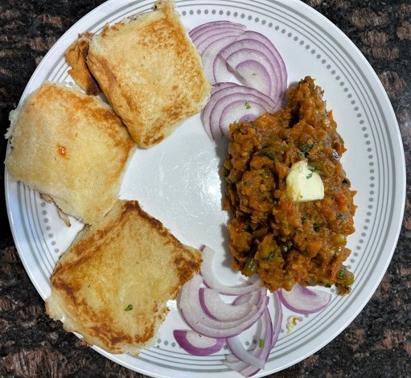

## Ingredients

* Onions- 2-3 large chopped finely
* Garlic- 7-8 big pods or 4-5 tsps finely chopped garlic
* Tomatoes- 3-4 medium chopped finely
* Tomato paste- 3-4 Tbsps or 1/2 cup
* Capsicum- 1-2 small or 1 medium finely chopped
* Potatoes- 2 large boiled and mashed
* Mixed boiled veggies 50 grams each cauliflower, carrots, peas and beans.
* Pav bhaji masala- 4-5 tsps
* Butter- 1-2 sticks
* Green chillies- 4-5 chopped (optional)
* Oil- 1/4 cup or 4-5 Tbsps
* Pav/ Buns- 10-12

## Method

First put 1/4 cup oil and 1/2- 3/4 stick of butter in a large wok or pan. 

Once oil/ butter melts, add garlic and saute till slightly brown.

Add onions and brown slightly. 

Add the capsicum and fry for 1-2 mins

Add pav bhaji masala and mix well for 1-2 mins

Add tomatoes and tomato paste and fry till oil separates.

Mix the boiled potatoes and veggies. Mash well with a masher and add in the masala and mix well to coat the onion tomatoes mixture. Add green chillies to make it spicier (optional)

Add 1/2 cup water and let it cook for 4-5 mins on a medium flame.

Once done add 1/2 stick of butter on top and lots of fresh coriander.

Serve with buttered pav which can be browned in a pan.