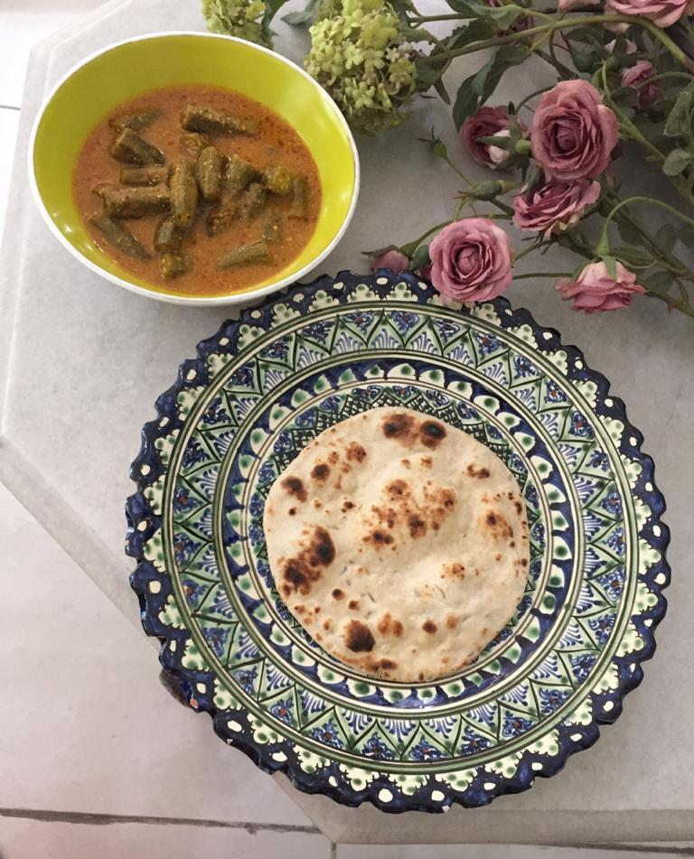

Servings: 2-3\
Difficulty: Easy

# Ingredients
* 300g okra (_bhindi_) cut into 2" pieces
* 1½ tablespoons mustard oil or neutral oil
* 2 tbsp yellow mustard seeds, ground to a powder
* 3 cups water 
* hot water to fry masala

### For spice paste
* ½ big onion
* 6 cloves garlic
* 1½“ ginger 
* 1 big tomato 
* 1 tsp whole cumin 
* 1 tsp whole coriander 
* 1 green chilli OR ¾ tsp red chilli powder (does not have to be ground)

# Directions 
Grind spice paste ingredients. Heat mustard oil till smoking point, let oil turn pale yellow, cool till warm. Add paste and fry on slow flame preferably, while adding 2 tablespoons of hot water to prevent burning. If using red chilli powder, add along with paste.

When oil floats on top, and the raw smell is gone, add okra, and 3 cups water, and cook covered till okra is tender. Add ground mustard paste, and cook open for about 5 minutes. The gravy will be thickish, and tiny pieces of mustard will be visible. That is the beauty.

I personally feel it tastes better after 6-8 hours, when the okra has released its juices in full. Goes well with plain boiled rice, chapati, missi roti, or naan. Enjoy!

This is a vegetarian adaptation of machher jhol, rohu fish cooked in yellow mustard sauce. My cook, Kalpana, was born in Bangladesh, and came to India in 1971 when she was three years old.
