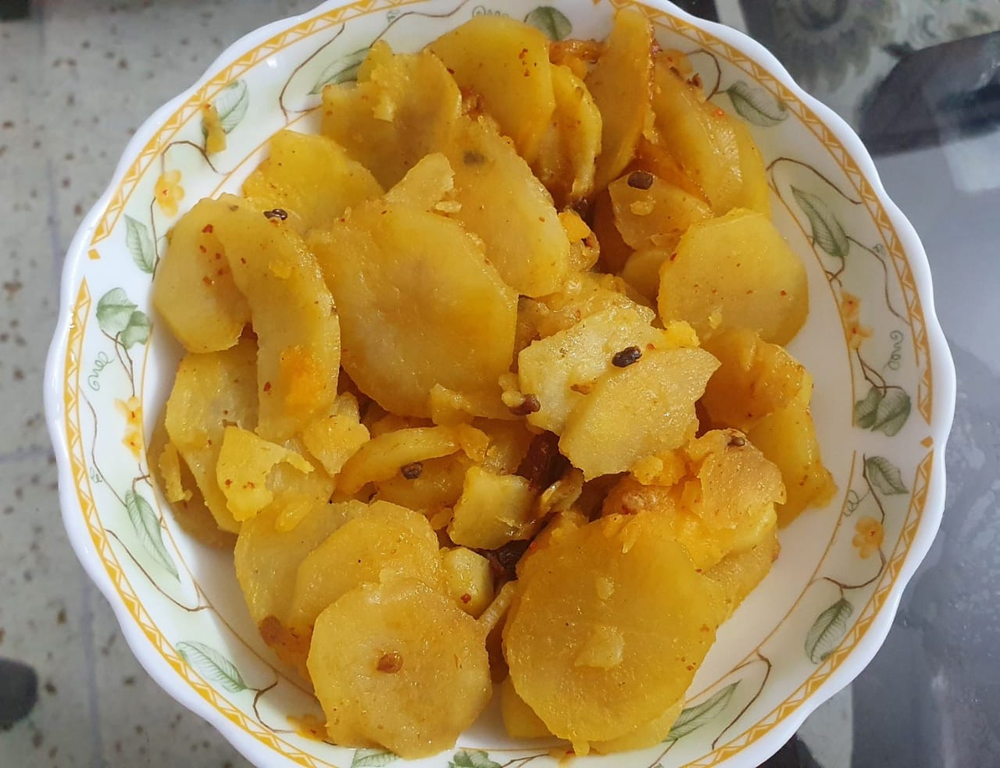

Servings: 4\
Prep Time: 05 mins\
Cook Time: 10 mins\
Difficulty: Easy\

# Ingredients
* 500g potato (_aaloo_)
* ½ medium onion, finely sliced
* ½ tsp red chilli powder or chilli flakes (_kati lal mirch_)
* Pinch of turmeric powder, for color
* 1 dry raw mango (_kali khatai_), soaked in very little water
* 1-2 dry red chillies, roughly broken into medium size
* ½tsp fenugreek seeds (_methi dana_)
* 1½ tbsp refined oil
* 1 tbsp salt, or to taste
* Coriander leaves (cilatro, _hari dhania ki patti_), roughly chopped for garnish (optional)

# Directions
Peel and cut potatoes in thin round slices (qatli). Heat oil in a heavy bottom pan (or kadhai) and put in fenugreek seeds and dry red chillies. Then add onion and sauté. Do not get color on the onions. Add potatoes once the onions are soft and translucent, then add salt, red chilli flakes, and haldi. Mix well but with light hand so that the potato qatli do not break. 

Add soaked khatai along with its water and again mix with light hands. Cover and cook on slow to medium flame for 8–10 mins. You can garnish with coriander leaves (_hara dhania_).

Qatli aaloo are served best with [Roghni Tikiya](/roghni-tikiya), [Khagina](/khagina), [Shami Kabab](/shami-kabab) (or kaleji) for an exquisite Oudhi breakfast. To finish, have some fresh cream (_balai_) with tikiya.

# Tips
> Use 2-3 garlic crushed and put in the oil first to get the smoky garlicky smell and flavour.

# Family Secret
> Kali khattai, raw dry mango piece, sabut khattai neutralises the sweetness. Always soak for about 5 mins in very little water to get it hydrated.
