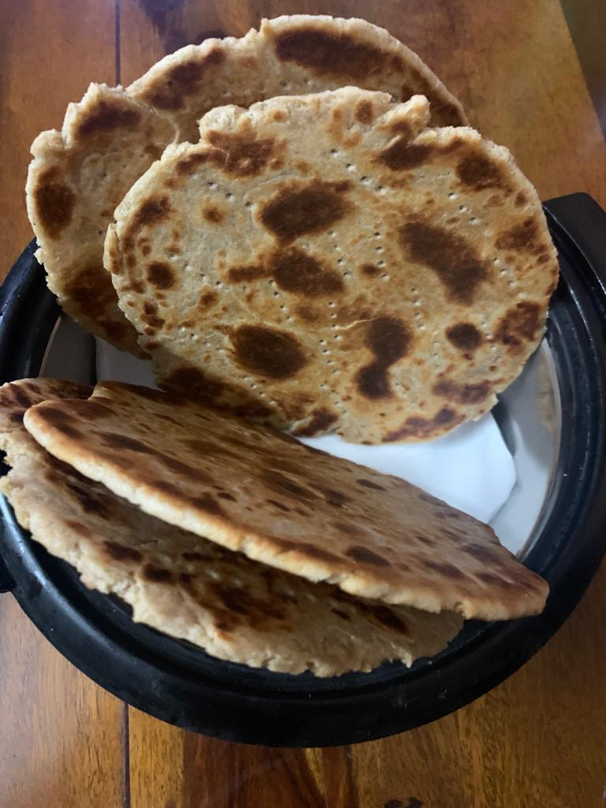

Servings: 4-5 tikiyas

# Ingredients
- 300g wheat flour (can also use half maida and half aata)
- 75g desi ghee
- 100ml lukewarm full cream milk
- 100ml oil (optional)
- Salt, to taste (requires double salt than a usual roti/paratha)

# Directions
Sprinkle salt over the flour and mix desi ghee. Kneed it with fingers till the whole ghee is absorbed by the flour and it becomes crumbly.

Mix in the milk slowly (important) to knead a rough dough. Make sure that you don't mix all of the milk at once. Keep kneeding with your knuckles till you see that the flour sticks well into a sigle lump.

Cover dough (air tight) and keep aside for 10-15 mins. Uncover the dough and knead for 2 mins more.

Make 4-5 equal portions (pedas) and roll them into a roti with rough ends. Don't use any extra flour while rolling as the dough will have enough ghee in it and it wont stick. While rolling, turn the roti multiple times to ensure the thickness of roti is consistent. Thickness of roghni roti should be at least double (or even thrice) of the normal tava roti. Each roti should be pricked multiple times using a fork on both the side to ensure that the heat goes in while cooking and the roti doesnt puff-up. 

On a pre-heated (high to start with) sear both the side, for 45 secs on each side, before you start pressing it. Bring the flame to medium and the press the roti slowly and consistently (you can use a little oil on both the side. You can also lace the roti with full cream milk at this point if you want a bit more "roghan") turning it only once and doing the same on the other side.

Make sure the periphery is cooked well as sometimes the rotis are thicker on the outside. When cooked, keep them vertical and not on top of each other (see the picture) otherwise rotis will get damp before you eat (even after 2 mins).

Roghni rotis are best enjoyed with
- Katle wale aalu
- Keema matar
- Shaami kababs
- Omlette / Khageena
