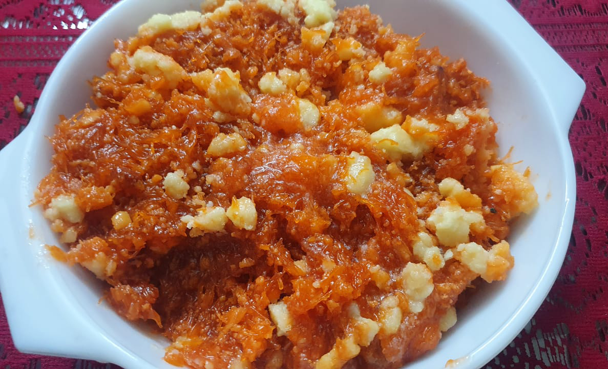

Photo Credit: Salim Rizvi  

# Ingredients

* ½ kg sewain
* 1¼ kg sugar
* 1½ kg milk
* Ghee for frying
* Khoya (optional)
* Pinch of saffron (*zafran*)
* Pinch of cardamom (*elaichi*) powder

# Directions
Brown (bhuno) sewain till golden. Dissolve milk and sugar in a separate pot and add to sewain. Cook till done.

Add khoya (optional). Add saffron and elaichi powder at the end.
