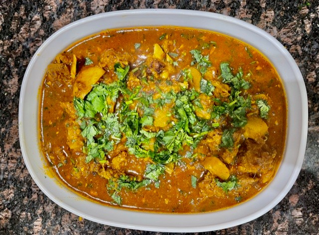

## Ingredients

* Mutton 800 grams- 1 kg
* Turnips (Shaljam)- 3-4 medium sized
* 3 Tbsp Ginger Garlic paste
* Onions- 1 large chopped
* Turmeric powder-1/2 tsp
* Coriander powder- 1 tsp
* Cumin powder- 1/2 tsp
* Curry powder- 2 tsps (optional)
* Red chilli powder- 1-2 tsps or as per taste
* Salt- 1-2 tsps or as per taste
* 1-2 tsps garam masala
* Tomatoes-3-4 medium chopped
* 1/2 cup tomato paste
* fresh coriander for garnishing
* 1/2 cup oil

## Method

Pour oil in a kadhai/wok. Add onions and fry till slightly golden brown

Add mutton and fry for 4-5 minutes till the color changes.

Add ginger garlic paste and fry another 7-8 mins till raw smell of meat disappears.

Add tomatoes, tomato paste, salt and all masalas  (except garam masala) and fry till oil separates. 

Cook 6-7 minutes till meat is slightly done

Add turnips/shaljam and fry for another 3-4 minutes till masala coasts the turnips,well.

At this point, if you're using a wok and need to cook faster, transfer to a pressure cooker and cook for 5-6 minutes at medium flame after the first whistle or cook in the wok for 20-25 mins till meat is tender.

Add 1-2 tsps garam masala on the top and garnish with lots of fresh coriander.

Enjoy with roti, naan or rice.