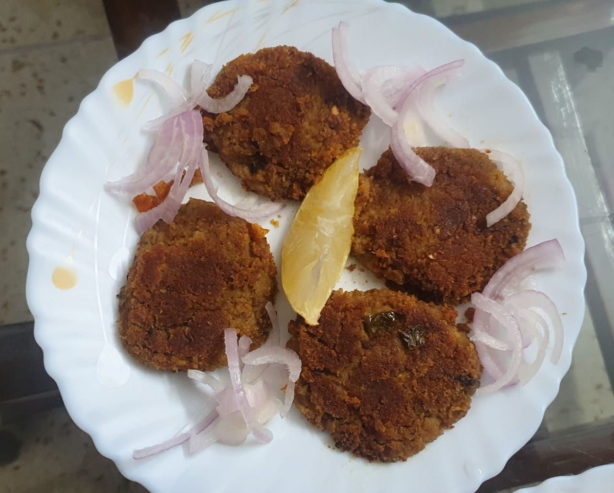

Photo Credit: Salim Rizvi

# Ingredients

### For cooking with the meat

* 500g ground meat
* 150g split chickpea (*chana daal*), soaked for half an hour
* 2 black cardamom pod (*badi elaichi*) seeds
* 2-3 green cardamom pod (*elaichi*) seeds
* 2-3 cloves
* 1 tsp cumin seeds (*zeera*)
* 8-10 black peppercorns 
* 2 dried red chillies, broken roughly or according to taste 
* 1” piece of cinnamon
* 12 cloves of garlic roughly chopped
* 2” piece of ginger, roughly chopped or grated
* 1 medium sized onion, sliced
* 1 cup water
* Salt, to taste

### For frying and assembly

* 1 medium size onion, thinly sliced and fried crisp then crushed by hand
* 2 heaped tablespoons chopped green coriander leaves/chopped mint leaves and 2 cut green chillies 
* 4 tsp lemon juice
* Oil, to fry

# Directions

Boil ground meat with ingredients in pressure cooker, and after first whistle reduce heat to low and cook  for 20-25 minutes. Turn off stove.

Open and dry up any water if present. Spread on a plate and let cool completely.

Grind in food processor till just done, it should not turn creamy.

Add crushed fried onions, chopped coriander/chopped mint, lemon juice, green chillies,  mix well, and check seasoning.

Form into approximately ½” thick and 2½“ diameter rounds. Drop a tablespoon or two of oil into a   thick bottom frying pan. Heat oil on medium and place kababs. Reduce heat to low. Keep dripping oil little by little and fry. When nicely browned, turn over carefully with thin edge flat spoon, and fry on other side. 

Drain on paper towel.

Serve hot with coriander chutney.
