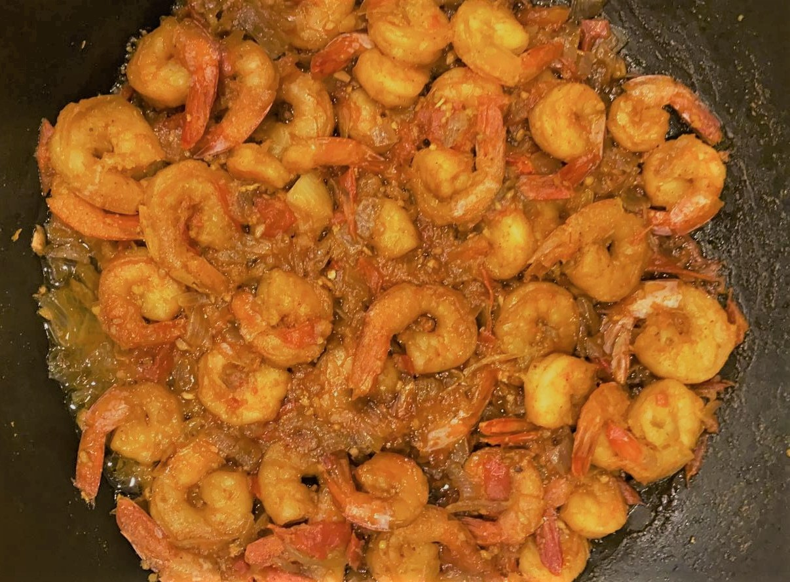

# Ingredients

* 2 lbs of Shrimp (cleaned with tails cut off)
* 1½ inch piece of ginger
* 1 whole pod of garlic
* 1 onion
* 2-4 green chilies
* 6 tomatoes of gravy
* 1 ½ tsp of turmeric
* Salt to taste
* 4 tbsp Oil

# Directions

1. Pour oil in a pan. Once warm saute the garlic, ginger, and green chili paste.
2. Once it is light brown in colour and you get a good fragrance, add onions ( they can be chopped or made into a paste).
3. Add salt and turmeric. Once all these ingredients are sauteed add the blended or finely chopped tomatoes to make a reasonable amount of gravy.
4. The last thing you add is shrimp. Cook for 5 minutes, not more otherwise it becomes tough and chewy.
5. Sprinkle finely cut green coriander over the curry.
6. Serve with rice