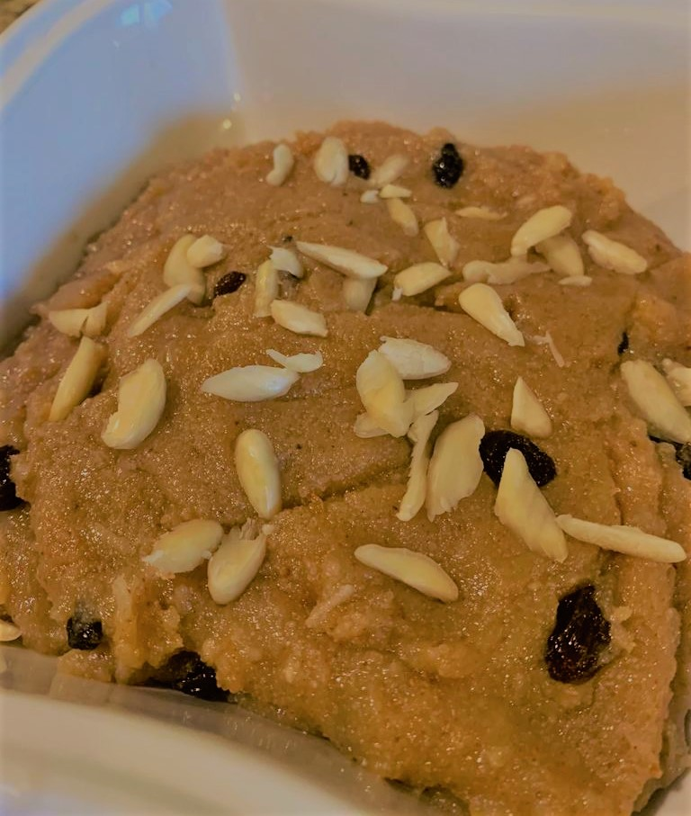

# Ingredients:

* 1 cup sooji
* 1 cup sugar
* 1 cup Powdered milk
* 1cup melted ghee
* 1 cup milk
* 1/2 cup dessicated coconut 
* 5-6 elaichi ( cardamom)
* nuts of your choice ( I add slivered almonds and raisins ) 

# Method:

Mix all the dry ingredients in a bowl.
Heat ghee in a pot and add illaichi to it .
Now add all the dry ingredients together and mix continously for about 15-20 minutes until desired brown color is obtained. 
Add milk and stir nicley until the ghee is separated. 
Now add the nuts and mix again. Remove from heat, garnish with coconut and nuts if required. 
Serve warm.