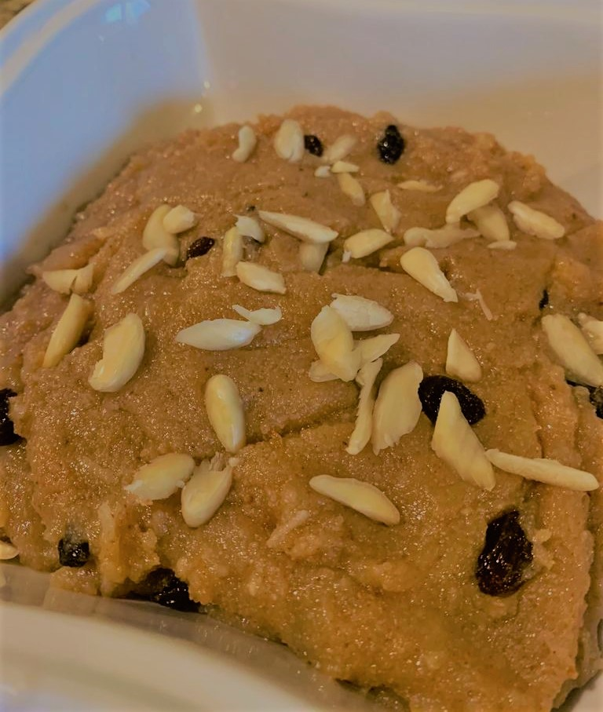

# Ingredients
* 1 cup semolina (_sooji_)
* 1 cup sugar
* 1 cup powdered milk
* 1 cup melted ghee
* 1 cup milk
* ½ cup dessicated coconut 
* 5-6 cardamom pods (_elaichi_)
* Nuts of your choice (I use slivered almonds and raisins) 

# Directions
Mix all the dry ingredients in a bowl.

Heat ghee in a pot and add elaichi to it. Now add all the dry ingredients together and mix continuously for about 15-20 minutes until desired brown color is obtained.

Add milk and stir nicely until the ghee is separated.

Now add the nuts and mix again. Remove from heat, garnish with coconut and nuts if required. 

Serve warm.
