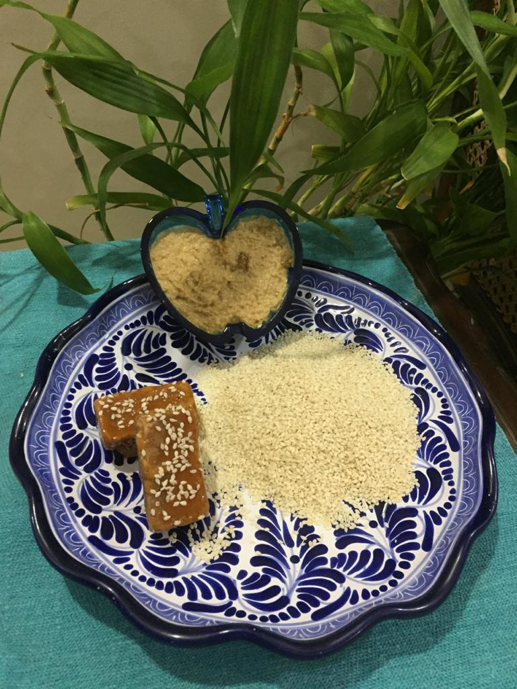

Difficulty: Easy

# Ingredients:

* 1 cup white sesame
* 4-5 tablespoons of water
* 3-4 tablespoons grated jaggery OR dark muscovado brown sugar OR maple syrup OR honey OR agave nectar OR coconut sugar

# Directions

Roast sesame over low heat till nearly light brown in colour. The aroma will also tell you that it’s ready. Do not over roast. Let cool. 

Put sesame in food processor with as much sweetening ingredient as you wish. Everyone has a different preference. Add water, and blend. 

Taste a little and check sweetness. Check the spreading consistency as well. Add more water if necessary. Enjoy!
