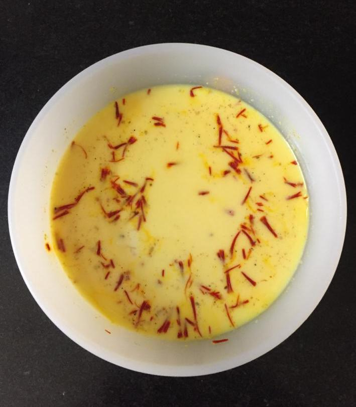

Servings: 5-6
Difficulty: Hard

# Ingredients

### For the mutton
* 500g mutton, mixed pieces from the leg including on the bone
* 100ml oil
* 250g onions, thinly sliced
* 15 cloves garlic, medium size
* 20 grams ginger
* 2" piece of cinnamon
* 2 bay leaves
* 8 black peppercorns 
* 2 brown cardamom seeds, pounded
* ½ tsp black cumin(shah zeera)
* 5 cloves
* 2 tsp whole coriander 
* ¾ cup whipped yogurt 
* 2 tsp salt
* 1 tsp red chilli powder 
* ½ tsp garam masala
* Hot water to fry masala
* 1½ cups water for cooking meat

### For the rice
* 300g good quality aged basmati rice
* 1½ tsp salt
* 1½" cinnamon 
* 10 black peppercorns 
* 2 bay leaves
* ½ tsp black cumin
* 20ml oil
* 1½ litres water to soak rice in

### For assembling in layers
* 60ml milk
* 30ml oil plus 1½ tbsp oil
* A pinch of saffron
* 6 ground green cardamom or equivalent cardamom powder

# Directions 

Soak saffron, cardamom powder, and 30mls oil in milk and put in fridge (rice ingredients).

Grind ginger, garlic, and coriander into a fine paste.

Fry onions along with cinnamon, bay leaves, peppercorns, black cumin, and cloves in oil till onions turn golden. Add 1 or 2 tablespoons of hot water to release colour from onions, and then add mutton.
Fry mutton till it is a nice brown colour on medium to medium high heat, stirring continuously. It should not stick to bottom of pan.

Add salt, red pepper, ginger-garlic-coriander paste. Add 2 tablespoons hot water till oil separates from masala and floats on top, ensuring that the raw smell of garlic and ginger has completely gone.

Add 1 tablespoon of yogurt at a time on slow heat till all is used up. Add 1½ cups water, and pressure cook on high heat. After 1 whistle, reduce to simmer, and cook for 18-20 minutes depending on the texture and type of meat. If on the bone, see it doesn't fall of the bone.

In the meanwhile, wash and soak rice for approximately 30 minutes, or according to instructions on packet. Turn off meat stove, cool, and open lid.

Add garam masala. The gravy should be slightly thickish, else reduce it.

Put rice up to boil in same water as it is soaking in, and add salt, oil, and spices. Choose a pot in which rice can puff up nicely. Cook till ¾ done (ek kanni). Strain, let water drain nicely.

Spread 1-1½ tablespoons of oil on heavy base pan. You will get a nice crispy layer of rice at the bottom(khurchan). Spread half of rice. Now spread all of meat on rice layer. Top with remaining rice.

Make small evenly spaced pockets in top layer of rice, and stir first the milk-saffron mixture, then pour (you can use a milk pot) in even amounts into the pockets.

Cover pot with a towel first, then the lid securely. See towel doesn't catch fire (fold back on lid, and put a weight on it. This will prevent water from falling back into the rice, prevent steam from escaping, and cook faster. 

Keep flame on low, and let biryani cook (dum stage) for approximately 20-25 minutes or until, when checking, a good amount of steam comes up. See if rice is done by pressing between two fingers. 

Alternatively, if doing dum in an oven, cover with foil, and bake at 250 F for 30 minutes. 

Finally, to mix, cut and fold rice and meat gently. Serve hot with garlic raita. Will taste better after 6-8 hours. Enjoy!
