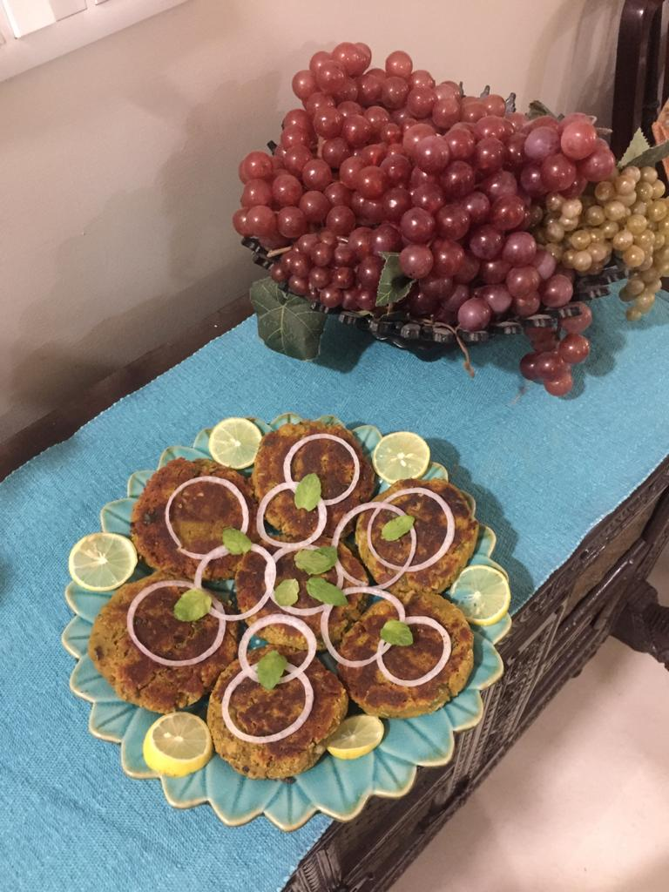

Servings: 6-7 burgers

Difficulty: Easy

# Ingredients

* 200 grams sponge gourd peels
* ½ cup yellow split peas (_chana daal_, soaked for 1 hour)
* ½ cup water 
* 2 tsp whole cumin
* ⅛ tsp garam masala 
* 1 tsp salt
* ½ tsp red chilli powder
* 1 tsp very finely chopped garlic
* 1 tsp very finely chopped ginger 
* oil for frying

### To be added after cooking:

* ½ cup finely chopped onions
* ¼ cup chopped green coriander (_cilantro_)
* 1 tbsp dry mango powder (_amchur_)

OR

* ½ tbsp lemon juice
* 1 green cut green chilli (optional)

# Directions

Put water in a pressure cooker. Add peels. On top add soaked yellow lentils and all spices plus ginger and garlic. Cover and cook.

After one whistle turn heat down to low, and cook for another 8-10 minutes giving the pressure cooker a good shake about 2-3 times to avoid sticking and burning.

Turn stove off. Open lid when pressure falls, and if any water remains, cook on slow till it evaporates. 

Cool, then grind in food processor till just blended. Add onions, chopped coriander, mango powder OR lemon juice along with green chillies (optional).

Form into patties, and shallow fry in a frying pan turning only once on each side. Patties should be evenly brown.

Serve hot with onion rings and chutney.

# Tips
> You can also make these kabas with bottle gourd (_lauki_) peels.
