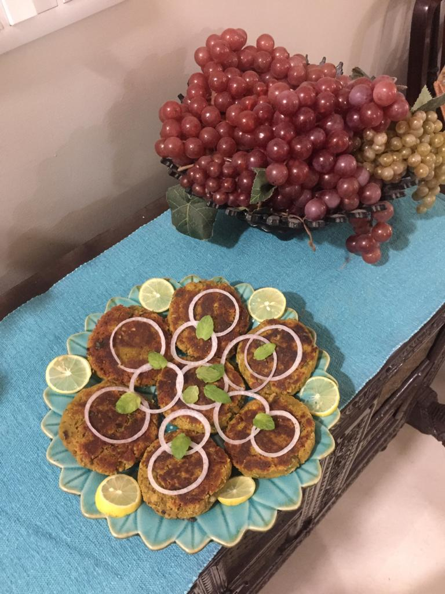

Servings: 6-7 burgers

Difficulty: Easy

# Ingredients

* 200 grams sponge gourd / bottle gourd peels (do not mix, either this or that)
* 1/2 cup yellow split peas(chana dal soaked for 1 hour)
* 1/2 cup water 
* 2 teaspoons whole cumin
* 1/8 teaspoon garam masala 
* 1 teaspoon salt
* 1/2 teaspoon red chilli powder
* 1 teaspoon very finely chopped garlic
* 1 teaspoon very finely chopped ginger 
* oil for frying

### To be added after cooking:

* 1/2 cup finely chopped onions
* 1/4 cup chopped green coriander(cilantro)
* 1 tablespoon dry mango powder(amchur)

OR

* 1/2 tablespoon lemon juice
* 1 green cut green chilli(optional)

# Directions

* Put water in a pressure cooker.
* Add peels.
* On top add soaked yellow lentils and all spices plus ginger and garlic.
* Cover and cook. 
* After one whistle turn heat down to low, and cook for another 8-10 minutes giving the pressure cooker a good shake about 2-3 times to avoid sticking and burning.
* Turn stove off. Open lid when pressure falls, and if any water remains, cook on slow till it evaporates. 
* Cool, then grind in food processor till just blended.
* Add onions, chopped coriander, mango powder OR lemon juice along with green chillies(optional).
* Form into patties, and shallow fry in a frying pan turning only once on each side. Patties should be evenly brown.
* Serve hot with onion rings and chutney.
