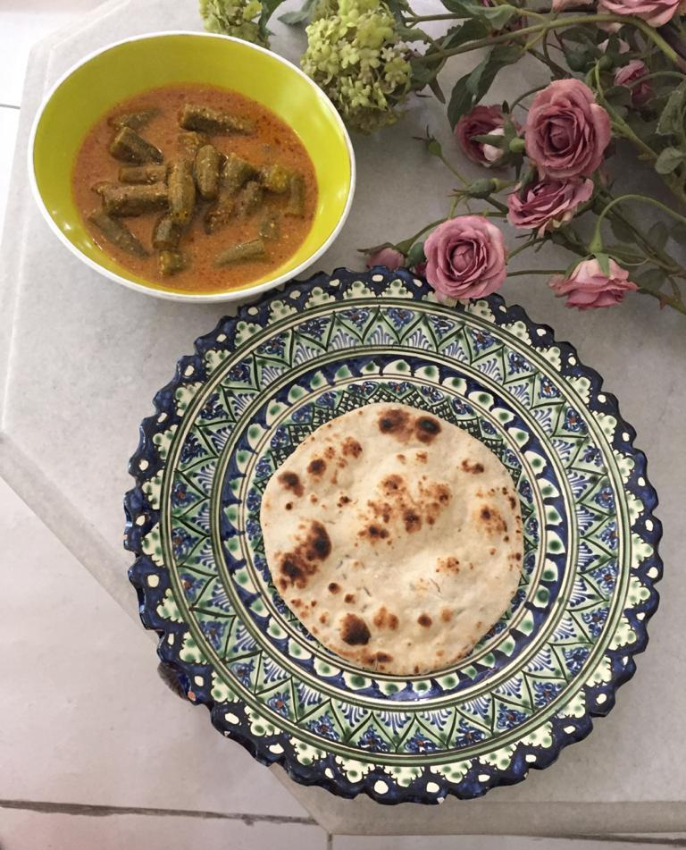

Difficulty: Easy  

# Ingredients
* 350g whole wheat flour
* 125g all purpose flour (_maida_)
* 5 tsp active dry yeast plus 2 tsp sugar
* ¼ tsp baking powder
* ½ tsp salt
* 250ml lukewarm milk
* 5 tsp melted clarified butter (_ghee_) or oil
* 70g castor or fine sugar
* ½-⅔ cup warm water
* 1¼ tsp lightly pounded fennel seed
* 1½ litres of oil to fry puris or some extra

### Leavening ingredients
* 5 tsp flour 
* 10 tsp yogurt
* 1 tsp sugar

# Directions
Mix leavening ingredients, cover, and leave for eight hours in a warm place to ferment.

Sieve the flours and baking powder. 

In a small bowl, put 3-4 tablespoons of lukewarm water from the ½-¾ cup amount, dry yeast, and 2 teaspoons sugar. Let ferment. 

In the meanwhile, add salt, 70g sugar, and fennel into the flours, and mix thoroughly. 

Make a well in the centre and add oil, both yeast and leavening preparations, and work flours into this using lukewarm milk first then lukewarm water enough to make a soft, but not sticky dough. Oil hands lightly at the end of kneading so dough doesn't become dry.

Cover with a cloth, and leave in a warm place to swell into double the size. 

Heat oil in wok or kadhai. Oil hands and break dough into  28-30 portions. Roll out into 3" diameter rounds.

Fry on medium high till evenly brown on both sides. They cook very fast. Remove with slotted spoon. Drain on paper towel. Enjoy with kababs, veggies, or just a cup of tea!

# Directions for Naan
You can use the fermented dough for making naans instead of puris.

Heat tawa on high, reduce to medium.

Break off 25 pieces of dough. Using flour, roll out into 4" diameter rounds. Sprinkle a little nigella or sesame and gently roll onto naan with rolling pin. 
Smear a little water on the other side and put the same side on the tawa so it sticks. When the naan starts puffing up, invert tawa, and cook on the other side, holding tawa 4-5" above flame, till spots appear as in picture. 
Remove and smear butter or ghee if you wish, or then just have it plain. It’s slightly sweet, and good with tea also.
