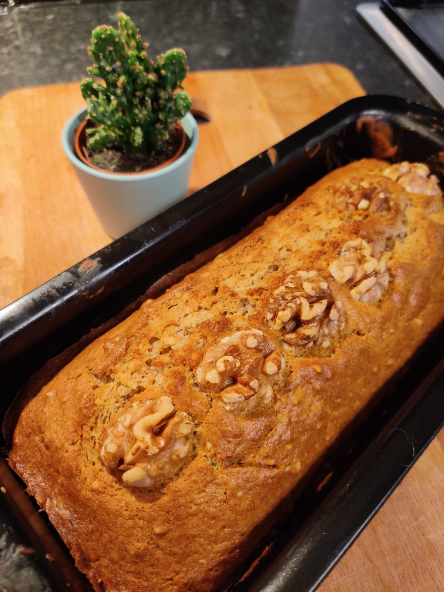

Prep time: 15 minutes  
Cooking time: 50 minutes  
Serves: 4-6 people  
Course: Tea Time  

# Ingredients
* ½ cup butter (at room temperature) 
* ¾ cup light brown sugar
* 2 medium eggs
* 1 cup mashed ripe bananas (about 3 medium)
* 1 cup all-purpose flour 
* 1 cup whole-wheat flour
* 1 tsp baking powder
* ½ tsp baking soda
* ½ tsp vanilla extract 
* ½ tsp salt
* ½ cup chopped walnuts

# Preparation
Preheat oven (with fan) to 150°C . 

Grease and flour one 9½ x 5½ inch loaf pan. In a large mixing bowl, cream the butter and sugar until well blended. Beat in the eggs, vanilla extract and mashed bananas.

In a small bowl combine flours, baking powder, soda and salt and blend into the creamed mixture. Stir in the nuts and turn into prepared pan. Bake 50 mins or until it is done.

# Tips
> Add walnut powder for more flavor.
